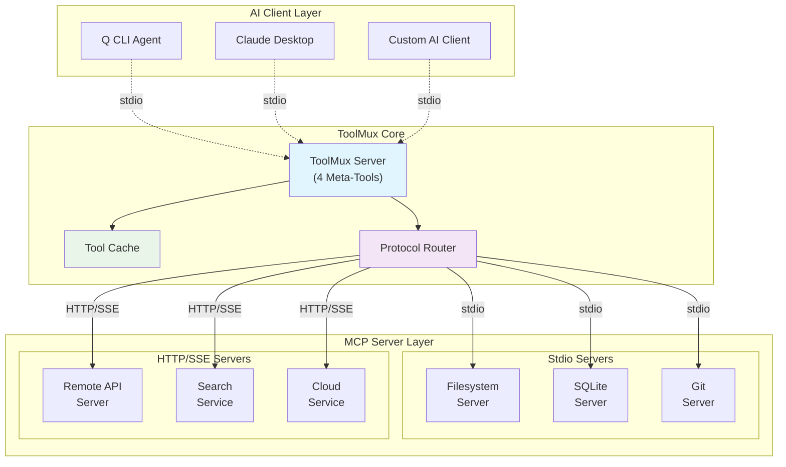
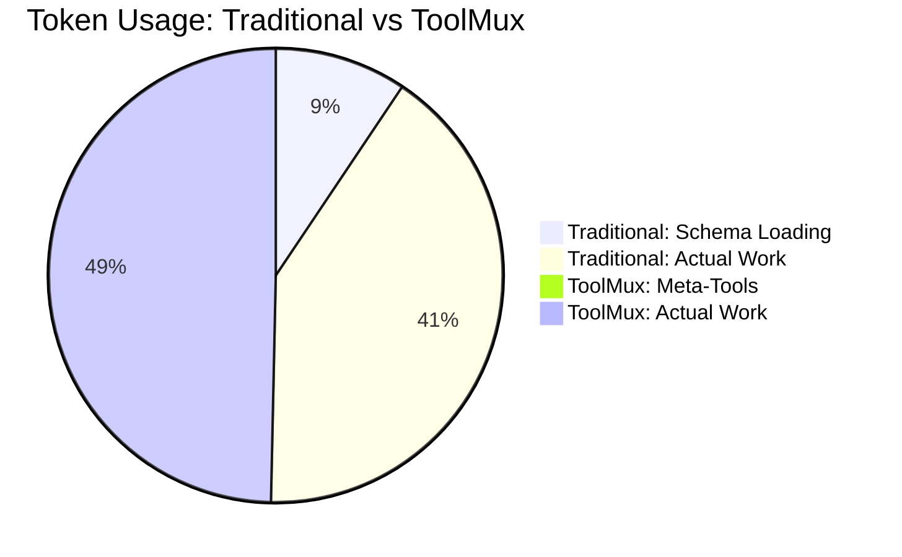
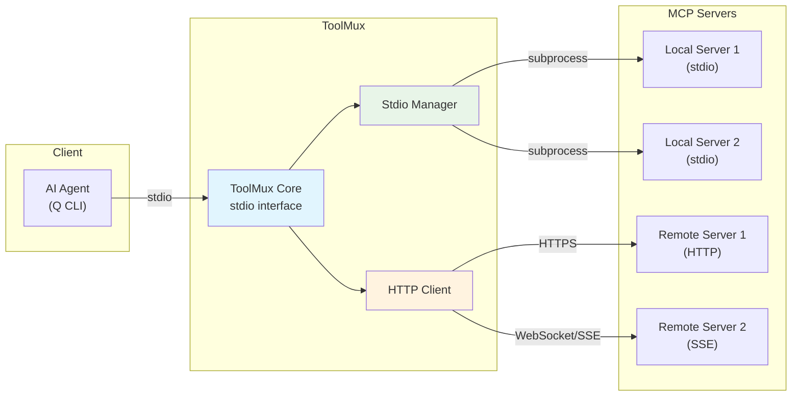
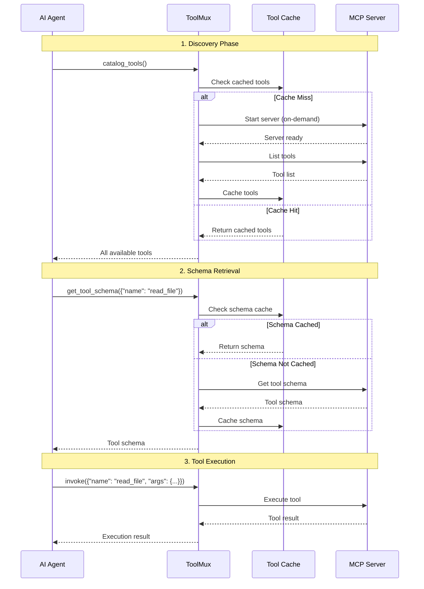
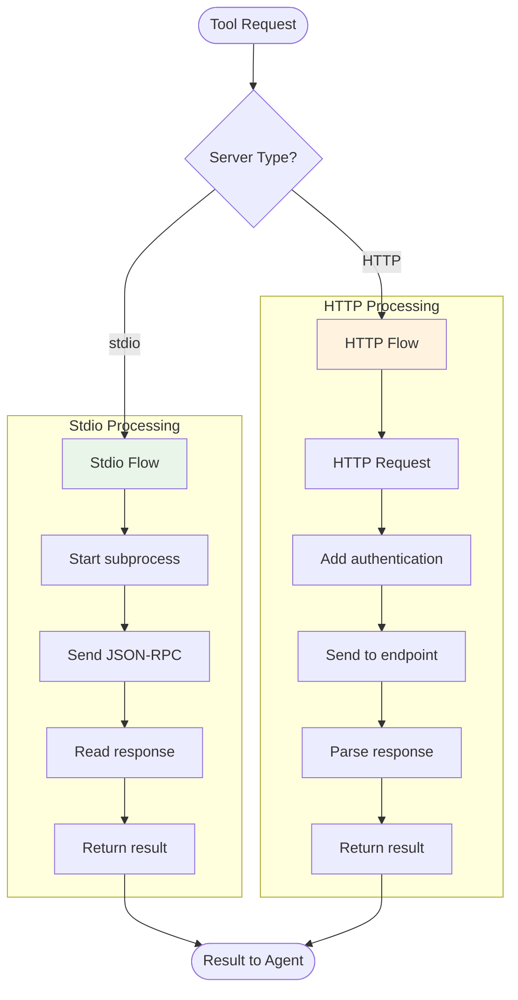
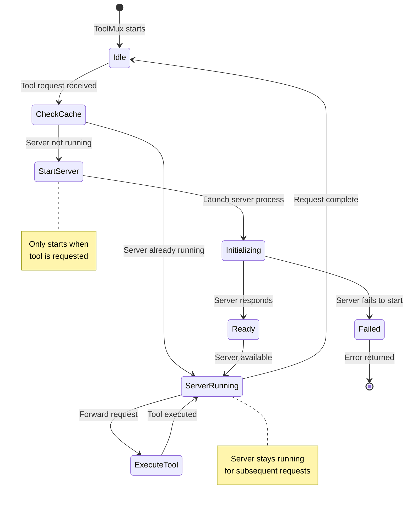
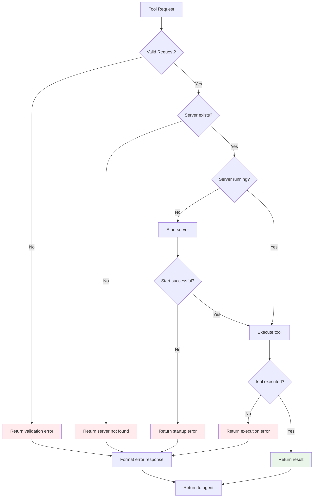

# ToolMux 🛠️

🚀 **98.65% Token Reduction** - Efficient MCP server aggregation with HTTP/SSE support and on-demand loading

[](https://www.python.org/downloads/)
[](https://opensource.org/licenses/MIT)
[](https://modelcontextprotocol.io/)

## The Problem

Traditional MCP bridges load **all tool schemas upfront**, consuming 15-20% of your token budget before you even start:

- Large deployments can have hundreds of tools across multiple servers
- Each schema consumes tokens even if never used
- Mixed stdio/HTTP servers require separate client implementations
- **Result**: Token budgets exhausted before real work begins

## The Solution

ToolMux exposes only **4 meta-tools** with unified stdio/HTTP support and loads servers on-demand:

| Approach | Tools Loaded | Token Usage | Transport Support | Functionality |
|----------|--------------|-------------|-------------------|---------------|
| **Traditional Bridge** | All schemas | 15-20% tokens | Single protocol | ✅ Full access |
| **ToolMux** | 4 meta-tools | 1.35% tokens | Mixed stdio/HTTP | ✅ Full access |

## Real Performance

In a deployment with 200+ tools across 11 MCP servers (stdio + HTTP):
- **Before**: ~20% token usage for schema loading
- **After**: 1.35% token usage with ToolMux  
- **Savings**: 98.65% reduction in overhead
- **Bonus**: Unified interface for mixed transport protocols

## Requirements

- **Python 3.10+** (required for fastmcp dependency)
- pip3 (Python package manager)
- Virtual environment support (recommended)

**Dependencies**:
- `fastmcp>=0.2.0` - FastMCP runtime for MCP protocol support
- `httpx>=0.24.0` - HTTP client for HTTP/SSE MCP servers
- `websockets>=11.0.0` - WebSocket support for real-time communication
- `pydantic>=2.6.0` - Data validation and settings management
- `click>=8.0.0` - CLI interface and command handling

**Note**: Python 3.10+ is required for full functionality including HTTP/SSE transport support.

## Installation

### Quick Install (Recommended)
```bash
uvx toolmux
```

That's it! ToolMux will auto-configure on first run.

**🎉 Now available on PyPI: https://pypi.org/project/toolmux/**

### Latest Updates (v1.2.1)
- ✅ **Fixed**: First-time setup now properly copies all bundled resources (`Prompt/`, `scripts/`, `examples/`)
- ✅ **Enhanced**: Complete local access to agent instructions and scripts after installation
- ✅ **Improved**: Better user experience with all resources available in `~/toolmux/`

### Alternative Methods

#### Install as Persistent Tool
```bash
uv tool install toolmux
```

#### Install from Git (Development)
```bash
uvx --from git+https://github.com/subnetangel/ToolMux toolmux
```

#### Install Specific Version
```bash
uvx toolmux@1.2.1
```

#### Manual Install (Development)
```bash
# Clone the repository
git clone https://github.com/subnetangel/ToolMux.git
cd ToolMux

# Install dependencies
pip install -r requirements.txt

# Run directly
python toolmux.py
```

## Quick Start

### 1. Install and First Run
```bash
# Install ToolMux
uvx toolmux

# First run creates configuration
toolmux --list-servers
```

On first run, ToolMux creates:
- `~/toolmux/mcp.json` - Your main configuration file
- `~/toolmux/examples/` - Reference configurations for copy-paste

### 2. Configure Your Servers
Edit `~/toolmux/mcp.json` to add your MCP servers:

```json
{
  "servers": {
    "filesystem": {
      "command": "npx",
      "args": ["-y", "@modelcontextprotocol/server-filesystem", "/home/user"],
      "description": "Local filesystem access"
    },
    "brave-search": {
      "command": "uvx", 
      "args": ["mcp-server-brave-search"],
      "env": {"BRAVE_API_KEY": "your-key"},
      "description": "Web search using Brave Search API"
    },
    "remote-api": {
      "transport": "http",
      "base_url": "https://api.example.com/mcp",
      "headers": {"Authorization": "Bearer your-token"},
      "timeout": 30,
      "description": "Remote HTTP MCP server"
    }
  }
}
```

### 3. Run ToolMux
```bash
# Basic usage
toolmux

# With custom config
toolmux --config /path/to/custom.json

# List configured servers
toolmux --list-servers

# See all options
toolmux --help
```

## How It Works

ToolMux exposes 4 efficient meta-tools:

### 🔍 Discovery
```bash
catalog_tools  # List all available tools from all servers
```

### 📋 Schema
```bash
get_tool_schema({"name": "read_file"})  # Get parameters for specific tool
```

### ⚡ Execute  
```bash
invoke({"name": "read_file", "args": {"path": "/tmp/test.txt"}})  # Run any tool
```

### 📊 Stats
```bash
get_tool_count  # Show tool count by server
```

## HTTP/SSE MCP Support 🌐

ToolMux supports **mixed configurations** with both stdio and HTTP/SSE MCP servers:

### Architecture
```
Q CLI (stdio) ↔ ToolMux (stdio) ↔ Mixed MCP Servers
                                  ├── stdio servers
                                  └── HTTP/SSE servers
```

### Benefits
- **Unified Interface**: Q CLI sees all tools as single stdio server
- **Mixed Deployments**: Combine local stdio + remote HTTP servers  
- **Transparent Routing**: ToolMux handles protocol translation
- **Backward Compatible**: Existing stdio configs unchanged
- **Scalable**: Add HTTP servers without Q CLI changes

### HTTP Server Configuration
```json
{
  "servers": {
    "local-stdio": {
      "command": "python", 
      "args": ["server.py"]
    },
    "remote-http": {
      "transport": "http",
      "base_url": "https://api.example.com/mcp",
      "headers": {"Authorization": "Bearer token"},
      "timeout": 30,
      "sse_endpoint": "/events"
    }
  }
}
```

### Authentication Options
- **Bearer Tokens**: `"Authorization": "Bearer your-token"`
- **API Keys**: `"X-API-Key": "your-api-key"`
- **OAuth**: `"Authorization": "Bearer oauth-token"`
- **Custom Headers**: Any additional headers needed

### Testing HTTP Support
```bash
# Start test HTTP server
python test_http_server.py

# Test mixed configuration
python test_http_transport.py

# Run ToolMux with mixed servers
./toolmux.py --config mixed_servers.json
```

## Adding Servers

ToolMux uses a single `mcp.json` configuration file. Copy examples from `~/toolmux/examples/` into your main config.

### Popular MCP Servers

#### Filesystem Access
```json
"filesystem": {
  "command": "npx",
  "args": ["-y", "@modelcontextprotocol/server-filesystem", "/home/user"],
  "description": "Local filesystem access"
}
```

#### Web Search (Brave)
```json
"brave-search": {
  "command": "uvx",
  "args": ["mcp-server-brave-search"],
  "env": {"BRAVE_API_KEY": "your-api-key"},
  "description": "Web search using Brave Search API"
}
```

#### Database Access (SQLite)
```json
"sqlite": {
  "command": "uvx",
  "args": ["mcp-server-sqlite", "--db-path", "/path/to/database.sqlite"],
  "description": "SQLite database queries"
}
```

#### GitHub Integration
```json
"github": {
  "command": "uvx",
  "args": ["mcp-server-github"],
  "env": {"GITHUB_PERSONAL_ACCESS_TOKEN": "your-token"},
  "description": "GitHub repository and issue management"
}
```

#### HTTP MCP Server
```json
"remote-api": {
  "transport": "http",
  "base_url": "https://api.example.com/mcp",
  "headers": {"Authorization": "Bearer your-token"},
  "timeout": 30,
  "description": "Remote HTTP MCP server"
}
```

### Configuration Reference

All server configurations support:
- `command` + `args`: Command to run (stdio servers)
- `transport`: "http" for HTTP servers (default: stdio)
- `base_url`: HTTP server endpoint
- `headers`: HTTP headers for authentication
- `timeout`: Request timeout in seconds
- `env`: Environment variables
- `cwd`: Working directory
- `description`: Human-readable description

## Agent Integration

### Q CLI Integration

#### Quick Start (Recommended)
```json
{
  "name": "simple-toolmux-agent",
  "mcpServers": {
    "toolmux": {
      "command": "uvx",
      "args": ["toolmux"],
      "timeout": 30000
    }
  },
  "tools": ["*"],
  "systemPrompt": "Use catalog_tools to see available tools, get_tool_schema for parameters, and invoke to execute tools."
}
```

#### Complete Configuration
See `toolmux/examples/q-cli-agent.json` for a comprehensive Q CLI configuration with:
- Detailed system prompt explaining ToolMux workflow
- All 4 meta-tools explicitly listed
- Hooks and examples
- Alternative installation methods

#### Available Examples
After installation, examples are available in the package:
```bash
# Find example configurations
python -c "import toolmux; import os; print(os.path.join(os.path.dirname(toolmux.__file__), 'examples'))"
```

- `q-cli-simple.json` - Minimal configuration to get started
- `q-cli-agent.json` - Complete configuration with all features
- `example_agent_config.json` - Legacy example (updated for v1.2.1)

### Other AI Clients
Include the agent instructions from the installed package to ensure proper meta-tool usage:

```bash
# After installing with uvx/uv, find the instructions at:
python -c "import toolmux; import os; print(os.path.join(os.path.dirname(toolmux.__file__), 'Prompt', 'AGENT_INSTRUCTIONS.md'))"
```

## Files Included

### Core Package
- `toolmux/main.py` - Main multiplexer server
- `toolmux/examples/` - Configuration examples and templates
- `toolmux/Prompt/AGENT_INSTRUCTIONS.md` - Agent behavior guide
- `toolmux/scripts/toolmux_hook.sh` - Q CLI agent hook

### Configuration Files
- `mcp.json` - Default server configuration (created on first run)
- Example configurations in `toolmux/examples/`:
  - `q-cli-simple.json` - Minimal Q CLI setup
  - `q-cli-agent.json` - Complete Q CLI configuration
  - `example_agent_config.json` - Legacy example (updated for v1.2.1)

## Benefits

✅ **98.65% token reduction** - Only 4 tools vs hundreds of schemas  
✅ **On-demand loading** - Servers start when needed  
✅ **Standard config** - Uses familiar `mcp.json` format  
✅ **Zero breaking changes** - Works with any MCP server  
✅ **Full functionality** - Access all tools through meta-tools  

## Use Cases

Perfect for:
- **AI Assistants** with multiple MCP servers
- **Token-constrained environments** 
- **Large MCP deployments** (10+ servers)
- **Development workflows** with many tools

## Architecture

### System Overview



### Token Usage Comparison



### Mixed Transport Architecture



## Interaction Flow

### Tool Discovery and Execution Flow



### HTTP vs Stdio Server Handling



### On-Demand Server Loading



### Error Handling Flow



## License

MIT License - see LICENSE file for details

---

*Built for the MCP community to make AI assistants more efficient* 🤖
