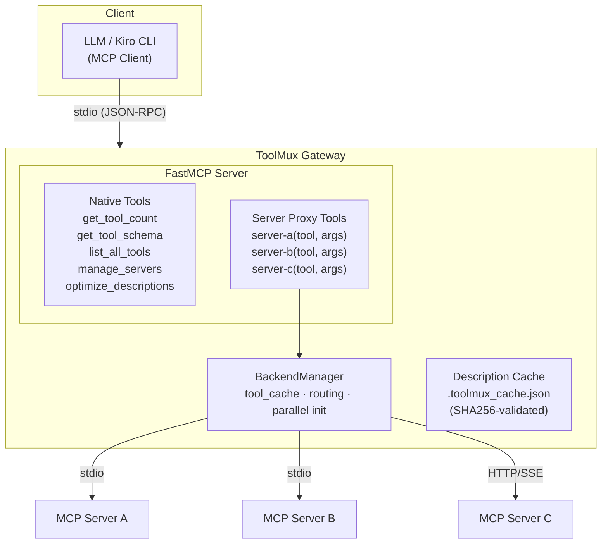
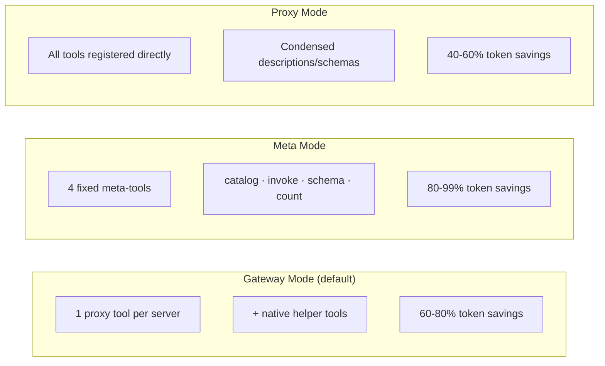
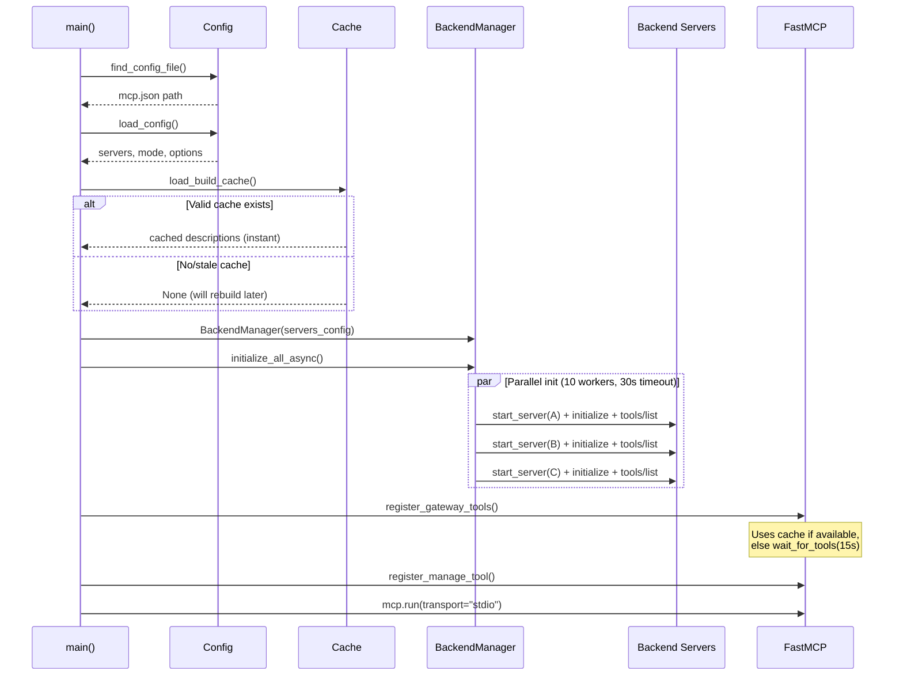
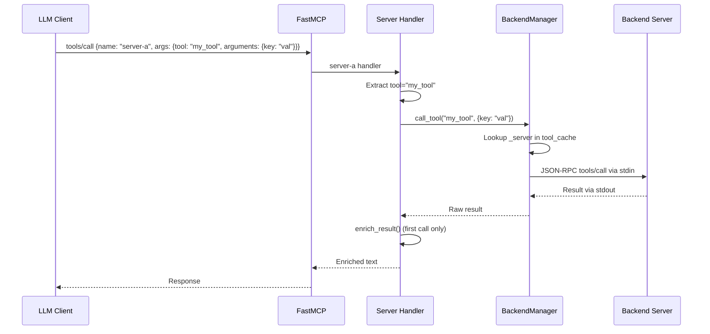
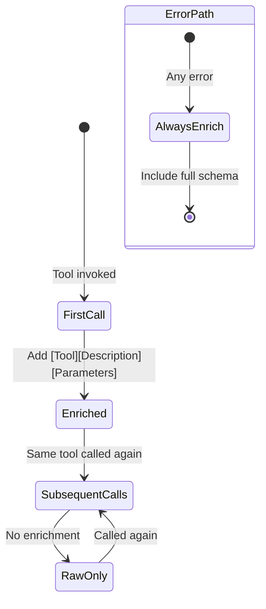
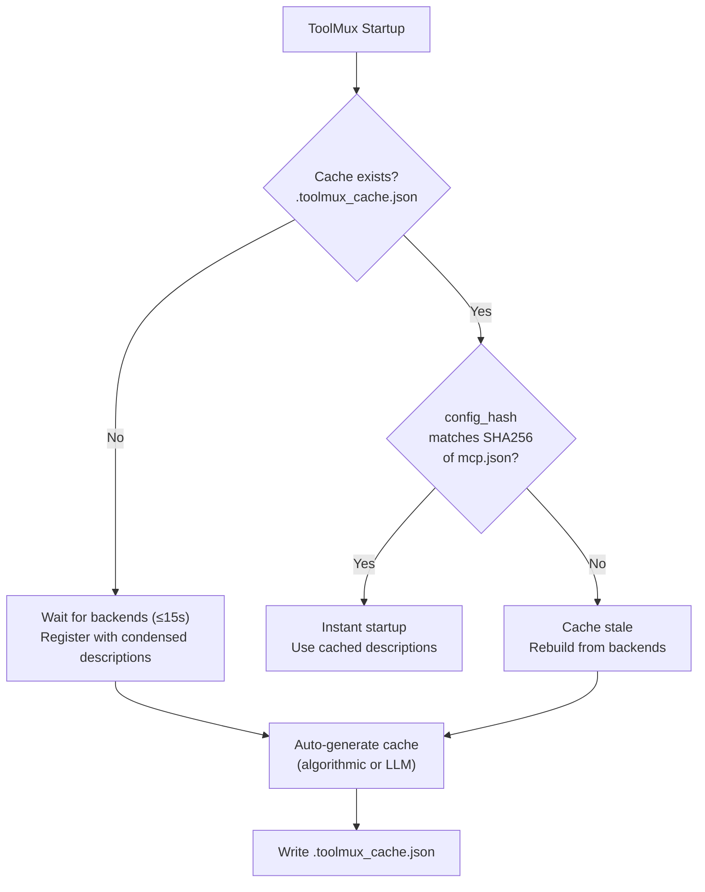
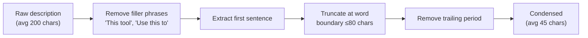
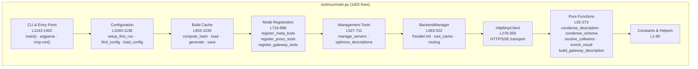
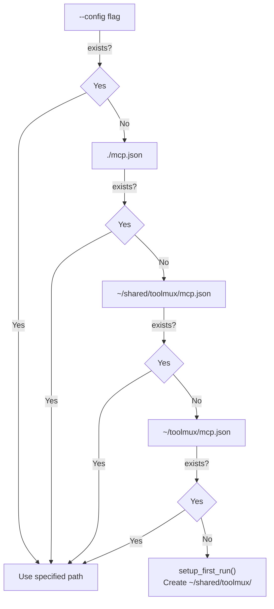
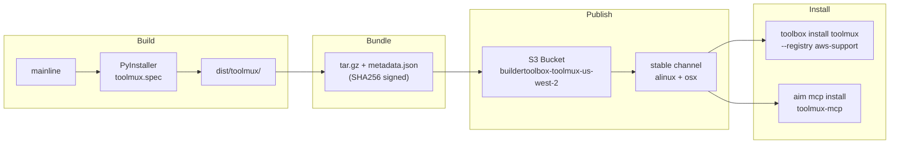

# ToolMux v2.0 Architecture & Design

## Overview

ToolMux is an MCP (Model Context Protocol) server aggregator that proxies multiple backend MCP servers through a single interface. Built on FastMCP 3.x, it reduces LLM token overhead by 60-99% while maintaining full tool access. All core logic lives in a single file: `toolmux/main.py` (~1400 lines).

## System Architecture


```mermaid
graph TB
    subgraph Client
        LLM["LLM / Kiro CLI<br/>(MCP Client)"]
    end

    LLM -->|"stdio (JSON-RPC)"| TM

    subgraph TM["ToolMux Gateway"]
        subgraph FastMCP["FastMCP Server"]
            Native["Native Tools<br/>get_tool_count<br/>get_tool_schema<br/>list_all_tools<br/>manage_servers<br/>optimize_descriptions"]
            Proxies["Server Proxy Tools<br/>server-a(tool, args)<br/>server-b(tool, args)<br/>server-c(tool, args)"]
        end
        BM["BackendManager<br/>tool_cache · routing · parallel init"]
        Cache["Description Cache<br/>.toolmux_cache.json<br/>(SHA256-validated)"]
    end

    Proxies --> BM
    BM -->|stdio| S1["MCP Server A"]
    BM -->|stdio| S2["MCP Server B"]
    BM -->|HTTP/SSE| S3["MCP Server C"]
```

## Operating Modes


```mermaid
graph LR
    subgraph Gateway["Gateway Mode (default)"]
        G1["1 proxy tool per server"]
        G2["+ native helper tools"]
        G3["60-80% token savings"]
    end
    subgraph Meta["Meta Mode"]
        M1["4 fixed meta-tools"]
        M2["catalog · invoke · schema · count"]
        M3["80-99% token savings"]
    end
    subgraph Proxy["Proxy Mode"]
        P1["All tools registered directly"]
        P2["Condensed descriptions/schemas"]
        P3["40-60% token savings"]
    end
```

### Gateway Mode (default, recommended)

One proxy tool per backend server. The LLM sees `server-name(tool="sub_tool", arguments={...})`.

| Registered Tools | Purpose |
|---|---|
| `<server-name>` (per server) | Route calls to backend sub-tools |
| `get_tool_count` | Tool counts by server |
| `get_tool_schema` | Full schema for any tool |
| `list_all_tools` | Enumerate all tools with descriptions |
| `manage_servers` | Add/remove/list backend servers |
| `optimize_descriptions` | Manage description cache |

### Meta Mode

Four fixed meta-tools. Maximum token savings, requires LLM to use invoke pattern.

| Tool | Purpose |
|---|---|
| `catalog_tools` | List all tools with descriptions |
| `get_tool_schema` | Full schema for a tool |
| `invoke` | Execute any backend tool |
| `get_tool_count` | Tool counts by server |

### Proxy Mode

All backend tools registered directly with condensed descriptions/schemas.

## Startup Sequence


```mermaid
sequenceDiagram
    participant CLI as main()
    participant Cfg as Config
    participant Cache as Cache
    participant BM as BackendManager
    participant Srv as Backend Servers
    participant MCP as FastMCP

    CLI->>Cfg: find_config_file()
    Cfg-->>CLI: mcp.json path
    CLI->>Cfg: load_config()
    Cfg-->>CLI: servers, mode, options

    CLI->>Cache: load_build_cache()
    alt Valid cache exists
        Cache-->>CLI: cached descriptions (instant)
    else No/stale cache
        Cache-->>CLI: None (will rebuild later)
    end

    CLI->>BM: BackendManager(servers_config)
    CLI->>BM: initialize_all_async()

    par Parallel init (10 workers, 30s timeout)
        BM->>Srv: start_server(A) + initialize + tools/list
        BM->>Srv: start_server(B) + initialize + tools/list
        BM->>Srv: start_server(C) + initialize + tools/list
    end

    CLI->>MCP: register_gateway_tools()
    Note over MCP: Uses cache if available,<br/>else wait_for_tools(15s)
    CLI->>MCP: register_manage_tool()
    CLI->>MCP: mcp.run(transport="stdio")
```

## Tool Call Flow (Gateway Mode)


```mermaid
sequenceDiagram
    participant LLM as LLM Client
    participant FM as FastMCP
    participant H as Server Handler
    participant BM as BackendManager
    participant Srv as Backend Server

    LLM->>FM: tools/call {name: "server-a", args: {tool: "my_tool", arguments: {key: "val"}}}
    FM->>H: server-a handler
    H->>H: Extract tool="my_tool"
    H->>BM: call_tool("my_tool", {key: "val"})
    BM->>BM: Lookup _server in tool_cache
    BM->>Srv: JSON-RPC tools/call via stdin
    Srv-->>BM: Result via stdout
    BM-->>H: Raw result
    H->>H: enrich_result() (first call only)
    H-->>FM: Enriched text
    FM-->>LLM: Response
```

## Progressive Disclosure


```mermaid
stateDiagram-v2
    [*] --> FirstCall: Tool invoked
    FirstCall --> Enriched: Add [Tool][Description][Parameters]
    Enriched --> SubsequentCalls: Same tool called again
    SubsequentCalls --> RawOnly: No enrichment
    RawOnly --> SubsequentCalls: Called again

    state ErrorPath {
        [*] --> AlwaysEnrich: Any error
        AlwaysEnrich --> [*]: Include full schema
    }
```

First invocation includes full description and schema. Subsequent calls return raw results only. Errors always include schema.

## Description Cache System


```mermaid
flowchart TD
    Start["ToolMux Startup"] --> Check{"Cache exists?<br/>.toolmux_cache.json"}
    Check -->|Yes| Hash{"config_hash<br/>matches SHA256<br/>of mcp.json?"}
    Check -->|No| NoCacheStart["Wait for backends (≤15s)<br/>Register with condensed descriptions"]
    Hash -->|Yes| Instant["Instant startup<br/>Use cached descriptions"]
    Hash -->|No| Stale["Cache stale<br/>Rebuild from backends"]
    NoCacheStart --> AutoGen["Auto-generate cache<br/>(algorithmic or LLM)"]
    Stale --> AutoGen
    AutoGen --> Write["Write .toolmux_cache.json"]
```

### Cache File: `.toolmux_cache.json`

```json
{
  "config_hash": "sha256-of-mcp.json",
  "model": "algorithmic|bedrock-model-id",
  "generated_at": "ISO-8601",
  "descriptions": {
    "server-name": {
      "tool-name": "Condensed description ≤80 chars"
    }
  }
}
```

## Token Optimization

### Condensation Pipeline


```mermaid
flowchart LR
    Raw["Raw description<br/>(avg 200 chars)"] --> Filler["Remove filler phrases<br/>'This tool', 'Use this to'"]
    Filler --> Sentence["Extract first sentence"]
    Sentence --> Truncate["Truncate at word<br/>boundary ≤80 chars"]
    Truncate --> Clean["Remove trailing period"]
    Clean --> Result["Condensed<br/>(avg 45 chars)"]
```

### Benchmarks

With 8 tools across 2 servers:

| Mode | Tokens | Savings |
|------|--------|---------|
| Raw | 1,157 | — |
| Meta | 226 | 80.5% |
| Gateway | 419 | 63.8% |
| Proxy | 654 | 43.5% |

With 258 tools across 9 servers (real FS-TAM deployment):

| Mode | Estimated Savings |
|------|-------------------|
| Gateway | ~95% |
| Meta | ~99% |

## Component Map


```mermaid
graph TD
    subgraph main.py["toolmux/main.py (1402 lines)"]
        A["Constants & Helpers<br/>L1-90"]
        B["Pure Functions<br/>L92-273<br/>condense_description · condense_schema<br/>resolve_collisions · enrich_result<br/>build_gateway_description"]
        C["HttpMcpClient<br/>L278-358<br/>HTTP/SSE transport"]
        D["BackendManager<br/>L363-522<br/>Parallel init · tool_cache · routing"]
        E["Management Tools<br/>L527-711<br/>manage_servers · optimize_descriptions"]
        F["Mode Registration<br/>L716-898<br/>register_meta_tools<br/>register_proxy_tools<br/>register_gateway_tools"]
        G["Build Cache<br/>L903-1035<br/>compute_hash · load · generate · save"]
        H["Configuration<br/>L1040-1138<br/>setup_first_run · find_config · load_config"]
        I["CLI & Entry Point<br/>L1143-1402<br/>main() · argparse · mcp.run()"]
    end

    I --> H --> G --> F --> E --> D --> C --> B --> A
```

## Configuration

### Config Discovery Order


```mermaid
flowchart TD
    A["--config flag"] -->|exists?| B{Yes}
    B -->|Yes| Use["Use specified path"]
    B -->|No| C["./mcp.json"]
    C -->|exists?| D{Yes}
    D -->|Yes| Use
    D -->|No| E["~/shared/toolmux/mcp.json"]
    E -->|exists?| F{Yes}
    F -->|Yes| Use
    F -->|No| G["~/toolmux/mcp.json"]
    G -->|exists?| H{Yes}
    H -->|Yes| Use
    H -->|No| I["setup_first_run()<br/>Create ~/shared/toolmux/"]
```

### mcp.json Structure

```json
{
  "mode": "gateway",
  "servers": {
    "server-name": {
      "command": "executable",
      "args": ["--flag", "value"],
      "timeout": 120000,
      "description": "Human-readable description"
    },
    "http-server": {
      "transport": "http",
      "base_url": "http://localhost:8080",
      "headers": {"Authorization": "Bearer token"}
    }
  },
  "_backend_tools": [...]
}
```

### Server Filtering

Servers can filter tools via `--include-tools`:
```json
{
  "command": "aws-sentral-mcp",
  "args": ["--include-tools", "search_accounts,get_account_details,..."]
}
```

## Transport Support

| Transport | Protocol | Use Case |
|---|---|---|
| **stdio** (default) | Newline-delimited JSON-RPC over stdin/stdout | Local MCP servers |
| **HTTP/SSE** | JSON-RPC over HTTP POST, SSE for streaming | Remote MCP servers |

## Collision Resolution

When multiple servers expose tools with the same name:
1. Detect duplicates in `resolve_collisions()`
2. Prefix with server name: `server-a__tool_name`
3. Non-colliding names remain unchanged

## Publishing & Distribution


```mermaid
flowchart LR
    subgraph Build
        Code["mainline"] --> PyI["PyInstaller<br/>toolmux.spec"]
        PyI --> Bin["dist/toolmux/"]
    end
    subgraph Bundle
        Bin --> Tar["tar.gz + metadata.json<br/>(SHA256 signed)"]
    end
    subgraph Publish
        Tar --> S3["S3 Bucket<br/>buildertoolbox-toolmux-us-west-2"]
        S3 --> Chan["stable channel<br/>alinux + osx"]
    end
    subgraph Install
        Chan --> TB["toolbox install toolmux<br/>--registry aws-support"]
        Chan --> AIM["aim mcp install<br/>toolmux-mcp"]
    end
```

| Platform | S3 Path |
|---|---|
| alinux | `s3://buildertoolbox-toolmux-us-west-2/tools/alinux/VERSION.tar.gz` |
| osx | `s3://buildertoolbox-toolmux-us-west-2/tools/osx/VERSION.tar.gz` |

## Test Suite

```
tests/
├── conftest.py              # Echo MCP server fixture, helpers
├── test_pure_functions.py   # Unit tests for condensation, collision, enrichment
├── test_token_optimization.py # Token savings benchmarks per mode
├── test_backend.py          # HttpMcpClient tests
├── test_config_cli.py       # Version sync, CLI tests
├── test_protocol_e2e.py     # Full MCP protocol E2E (meta, gateway, proxy)
└── test_list_all_tools.py   # list_all_tools unit + E2E tests
```

Run: `python3 -m pytest tests/ -v --tb=short`

## Version History

| Version | Date | Changes |
|---|---|---|
| 2.0.6 | 2026-02-25 | Add `list_all_tools` gateway tool |
| 2.0.5 | 2026-02-23 | Graceful stdin EOF, version sync, pyproject sync |
| 2.0.4 | 2026-02-22 | First-run no-cache handling, AIM toolbox binary |
| 2.0.3 | 2026-02-22 | Cache-first startup, incremental backend init |
| 2.0.0 | 2026-02-22 | FastMCP 3.x rewrite, three operating modes |

## Dependencies

| Package | Version | Purpose |
|---|---|---|
| fastmcp | ≥3.0.0,<4 | MCP server framework |
| mcp | ≥1.20.0 | MCP protocol types |
| click | ≥8.0.0 | CLI framework |
| pydantic | ≥2.6.0 | Data validation |
| httpx | ≥0.24.0 | HTTP client (SSE transport) |
| python-dotenv | ≥1.0.1 | Environment config |
