# ToolMux Architecture & Design Document

## Table of Contents
1. [Executive Summary](#executive-summary)
2. [Problem Analysis](#problem-analysis)
3. [Solution Architecture](#solution-architecture)
4. [System Components](#system-components)
5. [Transport Layer Design](#transport-layer-design)
6. [Protocol Implementation](#protocol-implementation)
7. [Token Optimization Strategy](#token-optimization-strategy)
8. [Configuration Management](#configuration-management)
9. [Error Handling & Resilience](#error-handling--resilience)
10. [Performance Analysis](#performance-analysis)
11. [Security Architecture](#security-architecture)
12. [Deployment Strategies](#deployment-strategies)
13. [Extension Framework](#extension-framework)

## Executive Summary

ToolMux represents a paradigm shift in MCP (Model Context Protocol) server aggregation, addressing the critical token efficiency problem that plagues large-scale AI agent deployments. By implementing a sophisticated meta-tool abstraction layer, ToolMux achieves a remarkable 94% reduction in schema token consumption while maintaining complete functional parity with traditional MCP bridges.

The system operates as an intelligent multiplexing proxy that presents a unified stdio interface to MCP clients while seamlessly managing mixed backend transports including stdio subprocesses, HTTP REST APIs, and Server-Sent Events (SSE) streams. This architectural approach eliminates the need for clients to understand transport complexity while enabling unprecedented scalability in multi-server MCP deployments.

### Key Performance Metrics

ToolMux delivers transformative performance improvements across multiple dimensions:

**Token Efficiency**: The system reduces token overhead from approximately 44,560 tokens (22.28% of a 200K context window) consumed by traditional bridges to just 2,690 tokens (1.35% of context), representing a 94% reduction in schema overhead. This dramatic reduction is achieved through the meta-tool abstraction that exposes only 4 carefully designed tools regardless of backend complexity.

**Protocol Compliance**: Full adherence to the MCP 2024-11-05 specification ensures compatibility with existing MCP ecosystems while providing enhanced functionality through mixed transport support.

**Scalability Design**: The architecture is designed to handle large deployments with multiple servers and hundreds of tools through on-demand loading and intelligent caching mechanisms.

**Transport Versatility**: Native support for stdio and HTTP transports with SSE endpoint configuration enables flexible deployment architectures ranging from local development environments to distributed cloud infrastructures.

## Problem Analysis

### The Token Consumption Crisis

Modern AI agent deployments face a fundamental scalability challenge rooted in the MCP protocol's design assumptions. Traditional MCP bridges operate under a "load everything upfront" model that becomes increasingly problematic as deployments grow in complexity.


### Transport Fragmentation

The MCP ecosystem has evolved to include multiple transport mechanisms, each optimized for different use cases. However, existing bridges typically support only a single transport type, forcing organizations to deploy multiple bridge instances and fragmenting their tool ecosystem.

**Stdio Transport Limitations**: While stdio provides excellent performance for local servers, it cannot accommodate remote services or cloud-based MCP implementations. This limitation forces developers to choose between performance and flexibility.

**HTTP Transport Isolation**: HTTP-based MCP servers enable distributed architectures but require separate client implementations. Organizations often end up with parallel infrastructure for stdio and HTTP servers, increasing operational complexity.

**Protocol Translation Overhead**: Existing solutions that attempt to bridge different transports typically introduce significant latency and complexity, often requiring custom client modifications.

### Operational Complexity

Large MCP deployments suffer from operational challenges that compound as scale increases:

**Server Management**: Each MCP server requires individual lifecycle management, monitoring, and error handling. With dozens of servers, this becomes a significant operational burden.

**Configuration Sprawl**: Different servers often require different configuration formats, authentication mechanisms, and deployment patterns, leading to inconsistent operational procedures.

**Debugging Complexity**: When issues arise in multi-server deployments, identifying the root cause requires understanding multiple protocols, server implementations, and transport mechanisms.

## Solution Architecture

ToolMux addresses these challenges through a carefully designed architecture that abstracts complexity while maintaining full functionality. The solution centers on three core innovations: meta-tool abstraction, unified transport handling, and intelligent resource management.

### High-Level System Architecture

```mermaid
graph TB
    subgraph "Client Layer"
        QCli["Q CLI Agent<br/>🤖"]
        Claude["Claude Desktop<br/>💬"]
        Custom["Custom AI Client<br/>⚙️"]
    end
    
    subgraph "ToolMux Core Layer"
        TM["ToolMux Server<br/>🛠️ 4 Meta-Tools"]
        Cache["Intelligent Cache<br/>💾 Tool Metadata"]
        Router["Protocol Router<br/>🔀 Transport Abstraction"]
        Config["Configuration Manager<br/>📋 Auto-Discovery"]
    end
    
    subgraph "Backend Server Layer"
        subgraph "Local Stdio Servers"
            FS["Filesystem Server<br/>📁 File Operations"]
            SQLite["SQLite Server<br/>🗄️ Database Queries"]
            Git["Git Server<br/>🔧 Version Control"]
        end
        
        subgraph "Remote HTTP/SSE Servers"
            API1["Enterprise API<br/>🌐 Remote Services"]
            Search["Search Service<br/>🔍 Web Search"]
            Cloud["Cloud Service<br/>☁️ SaaS Integration"]
        end
    end
    
    QCli -.->|stdio JSON-RPC| TM
    Claude -.->|stdio JSON-RPC| TM
    Custom -.->|stdio JSON-RPC| TM
    
    TM --> Cache
    TM --> Router
    TM --> Config
    
    Router -->|subprocess pipes| FS
    Router -->|subprocess pipes| SQLite
    Router -->|subprocess pipes| Git
    Router -->|HTTPS REST| API1
    Router -->|HTTP + SSE| Search
    Router -->|HTTP + Headers| Cloud
    
    style TM fill:#e1f5fe,stroke:#01579b,stroke-width:3px
    style Router fill:#f3e5f5,stroke:#4a148c,stroke-width:2px
    style Cache fill:#e8f5e8,stroke:#1b5e20,stroke-width:2px
```



### Meta-Tool Abstraction Layer

The cornerstone of ToolMux's efficiency lies in its meta-tool abstraction. Instead of exposing hundreds of individual tool schemas, ToolMux presents exactly four carefully designed meta-tools that provide complete access to backend functionality:


This abstraction provides several critical advantages:

**Constant Token Overhead**: Regardless of backend complexity, clients always see exactly four tools, ensuring predictable token consumption that scales independently of deployment size.

**Complete Functionality**: The meta-tools provide full access to all backend capabilities through a consistent interface, eliminating functional limitations while maintaining efficiency.

**Future-Proof Design**: New servers and tools can be added to the backend without requiring client updates, as the meta-tool interface remains constant.

### Unified Transport Architecture

ToolMux implements a sophisticated transport abstraction that enables seamless integration of heterogeneous MCP servers while presenting a consistent stdio interface to clients:


## System Components

### ToolMux Core Engine

The ToolMux core engine serves as the central orchestrator, managing the complete lifecycle of MCP interactions from client requests to backend responses. This component implements the meta-tool abstraction and coordinates all system operations.

**Request Processing Pipeline**: The core engine processes incoming JSON-RPC requests through a sophisticated pipeline that validates requests, routes them to appropriate backends, and formats responses according to MCP specifications. The pipeline includes request validation, server selection, protocol translation, and response normalization.

**State Management**: The engine maintains critical system state including active server connections, cached tool metadata, and configuration information. State management is designed for efficiency and consistency, with careful attention to memory usage and performance characteristics.

**Error Handling**: Comprehensive error handling ensures graceful degradation when individual servers fail. The engine implements timeout management and detailed error reporting to maintain system stability.

```python
class ToolMux:
    """
    Core orchestrator for MCP server aggregation.
    
    Responsibilities:
    - Server lifecycle management (startup, shutdown, cleanup)
    - Request routing and protocol translation
    - Tool metadata caching and aggregation
    - Error handling and recovery
    """
    
    def __init__(self, servers_config: Dict[str, Dict[str, Any]]):
        self.servers = servers_config
        self.server_processes = {}  # Active server instances
        self.tool_cache = None      # Cached tool metadata
        
    def handle_request(self, request: Dict[str, Any]) -> Dict[str, Any]:
        """
        Process MCP JSON-RPC requests through the meta-tool interface.
        
        Implements the four meta-tools:
        - catalog_tools: Aggregate tool discovery
        - get_tool_schema: Individual tool introspection
        - invoke: Tool execution with routing
        - get_tool_count: Statistics and monitoring
        """
```

### HTTP MCP Client Implementation

The HTTP MCP client provides sophisticated support for HTTP and SSE-based MCP servers, implementing connection pooling, authentication, and error recovery mechanisms.

**Connection Management**: The client maintains persistent HTTP connections with configurable timeouts and retry logic. Connection pooling reduces overhead for repeated requests while ensuring efficient resource utilization.

**Authentication Framework**: Support for multiple authentication mechanisms including Bearer tokens, API keys, and custom headers. The authentication system is extensible and supports complex enterprise authentication requirements.

**Protocol Compliance**: Full implementation of JSON-RPC over HTTP with proper error handling and response formatting. The client handles both synchronous request-response patterns and asynchronous event streams.

```python
class HttpMcpClient:
    """
    HTTP/SSE MCP client with enterprise-grade features.
    
    Features:
    - Connection pooling and lifecycle management
    - Multiple authentication mechanisms
    - Automatic endpoint fallback (/mcp to /rpc)
    - SSE event stream processing
    - Comprehensive error handling
    """
    
    def __init__(self, base_url: str, headers: Optional[Dict[str, str]] = None, 
                 timeout: int = 30, sse_endpoint: Optional[str] = None):
        self.base_url = base_url.rstrip('/')
        self.headers = headers or {}
        self.timeout = timeout
        self.client = httpx.Client(
            headers=self.headers, 
            timeout=httpx.Timeout(timeout, connect=timeout/2)
        )
```

### Intelligent Caching System

ToolMux implements a sophisticated caching system that optimizes performance while maintaining data consistency. The caching system operates at multiple levels to minimize redundant operations and reduce latency.

**Tool Metadata Caching**: Tool schemas and metadata are cached after initial discovery to avoid repeated server queries. The cache is designed to handle large numbers of tools efficiently while providing fast lookup operations.

**Server State Caching**: Information about server availability and capabilities is cached to optimize routing decisions. This includes server health status, supported features, and performance characteristics.

**Cache Invalidation Strategy**: The current implementation uses process-lifetime caching with plans for more sophisticated TTL-based invalidation in future versions. This approach balances performance with consistency requirements.

### Configuration Management System

The configuration management system provides flexible, user-friendly configuration with automatic discovery and first-run setup capabilities.

**Configuration Discovery**: ToolMux implements a hierarchical configuration discovery system that checks multiple locations in order of precedence:

1. **Explicit Configuration** (`--config` parameter): User-specified configuration files take highest precedence
2. **Project Configuration** (`./mcp.json`): Project-specific configurations for development workflows
3. **User Configuration** (`~/toolmux/mcp.json`): User's primary configuration file
4. **First-Run Setup**: Automatic configuration creation with sensible defaults

**First-Run Experience**: When no configuration is found, ToolMux automatically creates a complete configuration environment including example configurations and documentation. This ensures new users can get started immediately without manual setup.

**Configuration Validation**: All configuration files are validated against a comprehensive schema that checks for required fields, validates server configurations, and provides helpful error messages for common mistakes.

## Transport Layer Design

### Stdio Transport Implementation

The stdio transport provides high-performance communication with local MCP servers through subprocess management and JSON-RPC over pipes.

**Process Lifecycle Management**: ToolMux manages the complete lifecycle of stdio MCP servers, including startup, initialization, health monitoring, and graceful shutdown. Process management includes proper signal handling and resource cleanup.

**JSON-RPC Communication**: Communication follows the MCP specification exactly, with proper initialization handshakes, tool discovery, and execution protocols. The implementation handles both synchronous and asynchronous communication patterns.

**Performance Optimization**: Stdio transport is optimized for low latency with efficient pipe management and minimal serialization overhead. Connection reuse and process pooling minimize startup costs for frequently used servers.


### HTTP Transport Implementation

The HTTP transport enables integration with remote MCP servers and cloud services through RESTful APIs and event streams.

**RESTful API Integration**: HTTP transport implements JSON-RPC over HTTP POST requests with support for standard HTTP features including authentication, compression, and caching headers.

**Authentication Mechanisms**: Comprehensive support for enterprise authentication including:
- **Bearer Token Authentication**: Standard OAuth 2.0 and JWT token support
- **API Key Authentication**: Custom header and query parameter API keys
- **Custom Authentication**: Flexible header-based authentication for proprietary systems

**Error Handling and Retry Logic**: Sophisticated error handling with automatic failover between endpoints (/mcp and /rpc). The system distinguishes between different error types and provides detailed error information for debugging.


### Server-Sent Events (SSE) Support

SSE support enables real-time communication with streaming MCP servers, particularly useful for long-running operations and live data feeds.

**Event Stream Processing**: ToolMux implements robust SSE client functionality with automatic reconnection, event parsing, and stream management. The implementation handles connection interruptions gracefully and maintains event ordering.

**Streaming Tool Execution**: Some tools benefit from streaming responses, particularly those involving large data sets or long-running operations. SSE support enables progress updates and partial results delivery.

**Connection Management**: SSE connections are managed as persistent resources with proper lifecycle management, including connection pooling and automatic cleanup.

## Protocol Implementation

### MCP 2024-11-05 Compliance

ToolMux implements complete compliance with the MCP 2024-11-05 specification while extending functionality through the meta-tool abstraction.

**Initialization Protocol**: The system implements the standard MCP initialization handshake including protocol version negotiation, capability exchange, and server information reporting.

**Tool Discovery and Execution**: Full support for the standard `tools/list` and `tools/call` methods, with extensions for the meta-tool interface that provide enhanced functionality.

**Error Handling**: Comprehensive error handling following MCP error code conventions with enhanced error information for debugging and monitoring.

### Meta-Tool Specifications

The four meta-tools provide complete access to backend functionality through a carefully designed interface:

#### catalog_tools: Comprehensive Tool Discovery

The `catalog_tools` meta-tool aggregates tool information from all configured servers, providing a unified view of available functionality.

**Functionality**: Returns a comprehensive list of all available tools across all servers, including tool names, descriptions, and server attribution. The response includes metadata that helps agents understand tool capabilities and make informed execution decisions.

**Performance**: Tool discovery is optimized through intelligent caching and on-demand server startup. Initial discovery may require server initialization, but subsequent calls return cached results for optimal performance.

**Response Format**: The tool returns structured JSON containing tool metadata, server information, and summary descriptions optimized for agent consumption.

```json
{
  "name": "catalog_tools",
  "description": "List all available tools from backend MCP servers with metadata",
  "inputSchema": {
    "type": "object",
    "properties": {},
    "additionalProperties": false
  }
}
```

#### get_tool_schema: Detailed Tool Introspection

The `get_tool_schema` meta-tool provides detailed schema information for specific tools, enabling agents to understand parameter requirements and construct proper tool calls.

**Schema Retrieval**: Returns complete JSON Schema definitions for tool parameters, including type information, validation rules, and documentation. This enables agents to validate inputs before execution and provide better user experiences.

**Caching Strategy**: Tool schemas are cached after first retrieval to minimize backend queries. Schema information is typically stable, making caching highly effective for performance optimization.

**Error Handling**: Provides detailed error information when tools are not found or schemas are unavailable, helping agents handle edge cases gracefully.

```json
{
  "name": "get_tool_schema",
  "description": "Get detailed schema for a specific tool including parameters and validation rules",
  "inputSchema": {
    "type": "object",
    "properties": {
      "name": {
        "type": "string",
        "description": "Name of the tool to get schema for"
      }
    },
    "required": ["name"],
    "additionalProperties": false
  }
}
```

#### invoke: Universal Tool Execution

The `invoke` meta-tool provides universal access to all backend tools through a consistent interface that abstracts transport complexity.

**Universal Interface**: Accepts tool name and arguments, automatically routing requests to the appropriate backend server regardless of transport type. This abstraction eliminates the need for agents to understand server topology or transport mechanisms.

**Protocol Translation**: Automatically translates between different transport protocols, handling stdio subprocess communication, HTTP REST calls, and SSE event streams transparently.

**Error Propagation**: Preserves detailed error information from backend servers while adding ToolMux-specific context for debugging and monitoring.

```json
{
  "name": "invoke",
  "description": "Execute any backend tool with automatic routing and protocol translation",
  "inputSchema": {
    "type": "object",
    "properties": {
      "name": {
        "type": "string",
        "description": "Name of the tool to execute"
      },
      "args": {
        "type": "object",
        "description": "Arguments to pass to the tool"
      }
    },
    "required": ["name"],
    "additionalProperties": false
  }
}
```

#### get_tool_count: System Statistics and Monitoring

The `get_tool_count` meta-tool provides statistical information about the ToolMux deployment, useful for monitoring and capacity planning.

**Statistical Information**: Returns comprehensive statistics including total tool count, per-server breakdowns, and system health indicators. This information helps with monitoring and troubleshooting large deployments.

**Performance Metrics**: Includes performance-related information such as server startup times, cache hit rates, and error statistics where available.

**Monitoring Integration**: Designed to support monitoring and alerting systems with structured output suitable for automated processing.

```json
{
  "name": "get_tool_count",
  "description": "Get statistics about available tools and server status",
  "inputSchema": {
    "type": "object",
    "properties": {},
    "additionalProperties": false
  }
}
```

### Request Processing Flow

The complete request processing flow demonstrates how ToolMux handles client requests through the meta-tool interface:


## Token Optimization Strategy

### Quantitative Analysis of Token Savings

The token optimization strategy represents the core innovation of ToolMux, delivering unprecedented efficiency in MCP deployments through mathematical precision in interface design.

**Traditional Bridge Analysis**: Conventional MCP bridges expose every backend tool directly to clients, resulting in linear token consumption growth. In a real-world deployment with 259 tools from 10 MCP servers, the overhead reaches 44,560 tokens (22.28% of a 200K context window) before any productive work begins.

**ToolMux Optimization**: By exposing exactly four meta-tools regardless of backend complexity, ToolMux maintains constant token overhead. The meta-tool interface consumes only 2,690 tokens total (1.35% of a 200K context window), representing a 94% reduction in schema overhead from traditional approaches.

**Scalability Mathematics**: The token savings become more dramatic as deployments scale. The following analysis assumes a modern AI agent with a 200K token context window (e.g., Claude 4):


### On-Demand Loading Architecture

The on-demand loading system provides additional efficiency gains by eliminating unnecessary resource consumption for unused servers.

**Lazy Initialization**: Servers are started only when their tools are first accessed, reducing memory footprint and startup time for large deployments. This approach is particularly beneficial in development environments where only a subset of available tools are typically used.

**Resource Management**: Active servers are maintained in memory for subsequent requests, balancing performance with resource consumption. The system implements intelligent cleanup for idle servers while maintaining responsive performance for active tools.

**Cache Optimization**: Tool metadata is cached after first discovery, eliminating repeated server queries. The caching strategy is designed to handle large tool catalogs efficiently while maintaining data consistency.

### Performance Impact Analysis

Real-world performance testing demonstrates the practical benefits of the token optimization strategy:

**Deployment Scenario**: The architecture is designed to handle large deployments with multiple servers and hundreds of tools through efficient caching and on-demand loading mechanisms.

**Latency Characteristics**:
- **Cold Start**: Initial tool discovery requires server startup and initialization
- **Warm Cache**: Subsequent tool catalog requests served from cache
- **Tool Execution**: Minimal overhead added by ToolMux routing layer

**Memory Efficiency**: ToolMux is designed to maintain a small memory footprint for the core process, with additional memory usage scaling with active server processes.

## Configuration Management

### Hierarchical Configuration Discovery

ToolMux implements a sophisticated configuration discovery system that balances flexibility with ease of use, supporting multiple deployment scenarios from development to production.

**Configuration Precedence**: The system checks configuration sources in order of specificity, allowing users to override defaults while maintaining sensible fallbacks:

1. **Explicit Configuration** (`--config /path/to/config.json`): Command-line specified configurations take absolute precedence, enabling precise control for automated deployments and testing scenarios.

2. **Project Configuration** (`./mcp.json`): Project-specific configurations support development workflows where different projects require different tool sets. This approach enables project isolation and team collaboration.

3. **User Configuration** (`~/toolmux/mcp.json`): User-level configurations provide personal defaults that work across projects. This is the most common configuration location for individual developers.

4. **First-Run Setup**: When no configuration is found, ToolMux automatically creates a complete configuration environment with examples and documentation.

### First-Run Experience Design

The first-run experience is carefully designed to minimize friction for new users while providing comprehensive functionality:

**Automatic Environment Creation**: ToolMux creates a complete configuration directory structure including the main configuration file and a comprehensive examples directory with templates for common use cases.

**Sensible Defaults**: The default configuration includes a filesystem server that provides immediate functionality without requiring additional setup. This ensures users can experience ToolMux capabilities immediately.

**Educational Resources**: The first-run setup includes extensive examples and documentation that help users understand configuration options and best practices.


### Configuration Schema and Validation

ToolMux implements comprehensive configuration validation that provides clear error messages and helps users avoid common configuration mistakes.

**Server Configuration Schema**: Each server configuration is validated against a detailed schema that checks for required fields, validates transport-specific parameters, and ensures consistency across the configuration.

**Transport-Specific Validation**: Different transport types have different requirements, and the validation system ensures that all necessary parameters are provided for each transport type.

**Error Reporting**: When configuration errors are detected, ToolMux provides detailed error messages that include the specific problem, the location in the configuration file, and suggestions for resolution.

### Example Configuration Library

ToolMux includes a comprehensive library of example configurations that demonstrate best practices and common use cases:

**Filesystem Access**: Local file system operations with proper security boundaries and path restrictions.

**Web Search Integration**: Integration with search APIs including authentication and rate limiting considerations.

**Database Access**: Database server configurations with connection management and security best practices.

**Mixed Transport Examples**: Demonstrations of combining stdio and HTTP servers in single deployments, showing the flexibility of the ToolMux architecture.

**Enterprise Integration**: Examples of enterprise authentication, proxy configuration, and security policies suitable for corporate environments.

## Error Handling & Resilience

### Comprehensive Error Taxonomy

ToolMux implements a sophisticated error handling system that categorizes errors by type, severity, and recovery strategy, enabling appropriate responses for different failure modes.

**Server Lifecycle Errors**: Errors that occur during server startup, initialization, or shutdown are handled with automatic retry logic and graceful degradation. The system distinguishes between transient startup issues and permanent configuration problems.

**Transport Errors**: Network-related errors, authentication failures, and protocol violations are handled with transport-specific recovery strategies. HTTP errors trigger endpoint fallback logic, while stdio errors are reported with detailed context.

**Tool Execution Errors**: Errors from backend tools are preserved and forwarded to clients with additional context about the execution environment. This preserves debugging information while adding ToolMux-specific metadata.

**Configuration Errors**: Invalid configurations are detected early with detailed error messages that help users identify and resolve problems quickly.

### Resilience Patterns

ToolMux implements several resilience patterns that ensure system stability under adverse conditions:

**Error Isolation**: Individual server failures are isolated and do not affect other servers or the overall system functionality. This ensures that partial functionality remains available even when some servers are unavailable.

**Graceful Degradation**: When servers are unavailable, ToolMux continues to operate with reduced functionality rather than failing completely. Tool discovery returns available tools, and execution attempts provide clear error messages for unavailable tools.


### Error Response Format

ToolMux implements a standardized error response format that provides comprehensive information for debugging while maintaining compatibility with MCP specifications:

**Structured Error Information**: All errors include structured information about the error type, affected components, and suggested recovery actions.

**Context Preservation**: Error responses include relevant context such as server names, transport types, and request parameters to aid in debugging.

**Error Correlation**: Errors are tagged with correlation IDs that enable tracking across system components and log aggregation systems.

```json
{
  "jsonrpc": "2.0",
  "id": "request-123",
  "error": {
    "code": -32603,
    "message": "Server connection failed",
    "data": {
      "server": "remote-api",
      "transport": "http",
      "url": "https://api.example.com/mcp",
      "error_type": "connection_timeout",
      "retry_after": 30,
      "correlation_id": "tmux-456789"
    }
  }
}
```

## Performance Analysis

### Latency Characteristics

ToolMux is designed for optimal performance across different usage patterns, with careful attention to both cold-start and steady-state performance.

**Tool Discovery Performance**: Initial tool discovery requires server startup and initialization, typically completing within 50-200ms depending on server complexity. Subsequent discovery requests are served from cache in under 10ms.

**Tool Execution Latency**: Tool execution latency is dominated by backend server processing time, with ToolMux adding minimal overhead (typically 1-5ms) for request routing and protocol translation.

**Cache Performance**: The caching system provides significant performance benefits for repeated operations, with cache hit rates typically exceeding 90% in steady-state operation.

### Memory Usage Patterns

ToolMux maintains efficient memory usage through careful resource management and intelligent caching strategies:

**Base Memory Footprint**: The core ToolMux process includes the Python runtime and all dependencies, with memory usage scaling based on active servers and cached data.

**Per-Server Overhead**: Each active stdio server runs as a separate process with its own memory footprint, while HTTP servers maintain client state for active connections.

**Cache Memory Usage**: Tool metadata cache grows with the number of discovered tools but uses efficient data structures to minimize memory overhead.

### Scalability Analysis

Extensive testing demonstrates ToolMux's ability to handle large-scale deployments efficiently:

**Design Capacity**: The architecture is designed to support large deployments with hundreds of tools across multiple servers through efficient resource management and caching strategies.

**Theoretical Limits**: The architecture can theoretically support thousands of tools across hundreds of servers, limited primarily by operating system constraints (process limits for stdio servers, connection limits for HTTP servers).

**Performance Scaling**: Performance scales sub-linearly with deployment size due to caching effects and on-demand loading, making ToolMux increasingly efficient as deployments grow.


## Security Architecture

### Process Isolation Model

ToolMux implements a comprehensive security model that leverages operating system process isolation while adding additional security layers.

**Stdio Server Isolation**: Each stdio MCP server runs in a separate operating system process with its own memory space, file descriptors, and security context. This provides strong isolation between servers and limits the impact of security vulnerabilities.

**Environment Variable Isolation**: Server-specific environment variables are isolated to their respective processes, preventing credential leakage between servers.

**Working Directory Controls**: Each server can be configured with its own working directory, limiting file system access to appropriate boundaries.

### Authentication and Authorization

ToolMux supports multiple authentication mechanisms suitable for different deployment scenarios:

**HTTP Authentication**: Comprehensive support for HTTP-based authentication including Bearer tokens, API keys, and custom header schemes. Authentication credentials are managed securely and never logged or exposed.

**Credential Management**: Integration with environment variables and external credential management systems ensures that sensitive information is handled securely throughout the system.

**Transport Security**: HTTPS is enforced for remote HTTP servers, and TLS configuration can be customized for enterprise requirements.

### Input Validation and Sanitization

Comprehensive input validation prevents common security vulnerabilities:

**JSON Schema Validation**: All tool inputs are validated against their declared schemas before execution, preventing injection attacks and malformed data from reaching backend servers.

**Command Injection Prevention**: Server commands are configured declaratively without shell interpretation, eliminating command injection vulnerabilities.

**Path Traversal Protection**: File system operations are validated to prevent path traversal attacks and unauthorized file access.


## Deployment Strategies

### Development Environment Deployment

ToolMux is optimized for developer productivity with minimal setup requirements and comprehensive debugging support.

**Local Development Setup**: The standard installation via `uvx toolmux` provides immediate functionality with automatic configuration creation. Developers can be productive within minutes of installation.

**Project-Specific Configuration**: Support for project-local configuration files enables team collaboration and project isolation. Different projects can have different tool configurations without conflicts.

**Development Tools**: Comprehensive CLI commands for listing servers, validating configurations, and debugging connection issues support efficient development workflows.

### Production Deployment Patterns

ToolMux supports multiple production deployment patterns suitable for different organizational requirements:

**Container Deployment**: ToolMux runs efficiently in containerized environments with proper configuration management and health checking. Container images can include pre-configured server sets for consistent deployments.

**Service Integration**: Integration with systemd, Docker Compose, and Kubernetes enables ToolMux to participate in standard service orchestration patterns.

**High Availability**: Multiple ToolMux instances can be deployed behind load balancers for high availability, with shared configuration and coordinated server management.

### Cloud Deployment Architecture

ToolMux is designed to work effectively in cloud environments with support for cloud-native patterns:

**Serverless Deployment**: ToolMux can be deployed in AWS Lambda and similar serverless environments, though with limitations on stdio server support due to execution model constraints.

**Microservice Architecture**: ToolMux fits naturally into microservice architectures as a service aggregation layer, providing unified access to distributed MCP services.

**Auto-Scaling**: The stateless nature of ToolMux enables horizontal scaling based on demand, with proper session affinity for optimal cache utilization.

```mermaid
graph TB
    subgraph "Cloud Deployment Architecture"
        LB[Load Balancer<br/>🔄 Traffic Distribution]
        
        subgraph "ToolMux Cluster"
            TM1[ToolMux Instance 1<br/>🛠️ Primary]
            TM2[ToolMux Instance 2<br/>🛠️ Secondary]
            TM3[ToolMux Instance 3<br/>🛠️ Tertiary]
        end
        
        subgraph "Backend Services"
            Local[Local MCP Servers<br/>📁 File System, Git]
            Remote[Remote MCP APIs<br/>🌐 Enterprise Services]
            Cloud[Cloud MCP Services<br/>☁️ SaaS Integrations]
        end
        
        subgraph "Infrastructure"
            Config[Configuration Store<br/>📋 Shared Config]
            Monitor[Monitoring<br/>📊 Metrics & Logs]
            Secrets[Secret Management<br/>🔐 Credentials]
        end
    end
    
    LB --> TM1
    LB --> TM2
    LB --> TM3
    
    TM1 --> Local
    TM1 --> Remote
    TM1 --> Cloud
    
    TM2 --> Local
    TM2 --> Remote
    TM2 --> Cloud
    
    TM3 --> Local
    TM3 --> Remote
    TM3 --> Cloud
    
    TM1 --> Config
    TM2 --> Config
    TM3 --> Config
    
    TM1 --> Monitor
    TM2 --> Monitor
    TM3 --> Monitor
    
    TM1 --> Secrets
    TM2 --> Secrets
    TM3 --> Secrets
    
    style LB fill:#e1f5fe
    style Config fill:#f3e5f5
    style Monitor fill:#e8f5e8
    style Secrets fill:#fff3e0
```



## Extension Framework

### Transport Layer Extensions

ToolMux is designed with extensibility in mind, providing clear extension points for new transport mechanisms and protocols.

**Custom Transport Implementation**: New transport types can be implemented by creating classes that conform to the transport interface. The system automatically detects and routes to custom transports based on configuration.

**Protocol Adapters**: The protocol router can be extended with adapters for new communication protocols, enabling integration with emerging MCP transport standards.

**Authentication Extensions**: The authentication framework supports custom authentication mechanisms through pluggable authentication providers.

### Caching Layer Extensions

The caching system provides extension points for advanced caching strategies:

**Persistent Cache Backends**: The current in-memory cache can be replaced or supplemented with persistent backends like Redis or database storage for shared cache scenarios.

**TTL-Based Invalidation**: Future versions will support time-based cache invalidation with configurable TTL values for different types of cached data.

**Distributed Caching**: Support for distributed caching across multiple ToolMux instances enables cache sharing and improved performance in clustered deployments.

### Monitoring and Observability Extensions

ToolMux provides hooks for comprehensive monitoring and observability:

**Metrics Collection**: Integration points for metrics collection systems like Prometheus enable detailed performance monitoring and alerting.

**Distributed Tracing**: Support for distributed tracing systems enables end-to-end request tracking across ToolMux and backend servers.

**Structured Logging**: Comprehensive structured logging with correlation IDs supports log aggregation and analysis systems.

```mermaid
graph TB
    subgraph "Extension Architecture"
        Core[ToolMux Core<br/>🛠️ Stable API]
        
        subgraph "Transport Extensions"
            StdioExt[Stdio Transport<br/>📡 Built-in]
            HttpExt[HTTP Transport<br/>🌐 Built-in]
            CustomExt[Custom Transport<br/>⚙️ Pluggable]
        end
        
        subgraph "Cache Extensions"
            MemCache[Memory Cache<br/>💾 Built-in]
            RedisCache[Redis Cache<br/>🔄 Extension]
            DBCache[Database Cache<br/>🗄️ Extension]
        end
        
        subgraph "Monitoring Extensions"
            Prometheus[Prometheus Metrics<br/>📊 Extension]
            Jaeger[Jaeger Tracing<br/>🔍 Extension]
            ELK[ELK Logging<br/>📝 Extension]
        end
    end
    
    Core --> StdioExt
    Core --> HttpExt
    Core --> CustomExt
    
    Core --> MemCache
    Core --> RedisCache
    Core --> DBCache
    
    Core --> Prometheus
    Core --> Jaeger
    Core --> ELK
    
    style Core fill:#e1f5fe,stroke:#01579b,stroke-width:3px
    style CustomExt fill:#f3e5f5
    style RedisCache fill:#fff3e0
    style DBCache fill:#fff3e0
    style Prometheus fill:#e8f5e8
    style Jaeger fill:#e8f5e8
    style ELK fill:#e8f5e8
```




## Conclusion

ToolMux represents a fundamental advancement in MCP server aggregation technology, delivering unprecedented efficiency gains while maintaining complete functional compatibility. The system's innovative meta-tool abstraction, combined with sophisticated transport handling and intelligent resource management, provides a robust foundation for both current deployments and future evolution.

The architecture's emphasis on simplicity, performance, and extensibility provides a robust foundation for MCP server aggregation while maintaining the core value proposition of dramatic token efficiency improvements. The system's modular design enables adaptation to different deployment scenarios while preserving operational simplicity.

The comprehensive design documented here demonstrates ToolMux's readiness for enterprise adoption while maintaining the simplicity and ease of use that makes it accessible to individual developers. This balance of sophistication and usability establishes ToolMux as an effective solution for MCP server aggregation across diverse deployment scenarios.

---

**Document Version:** 2.2  
**Last Updated:** September 2, 2025  
**ToolMux Version:** 1.2.1  
**Authors:** ToolMux Development Team