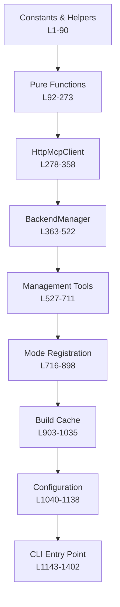
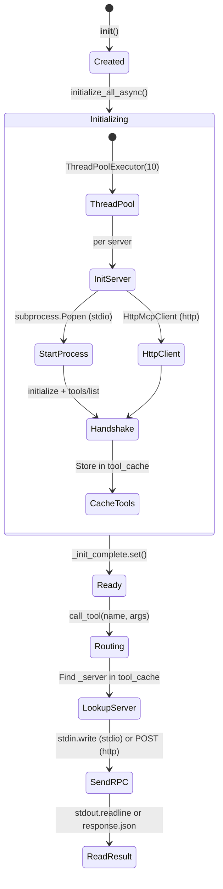
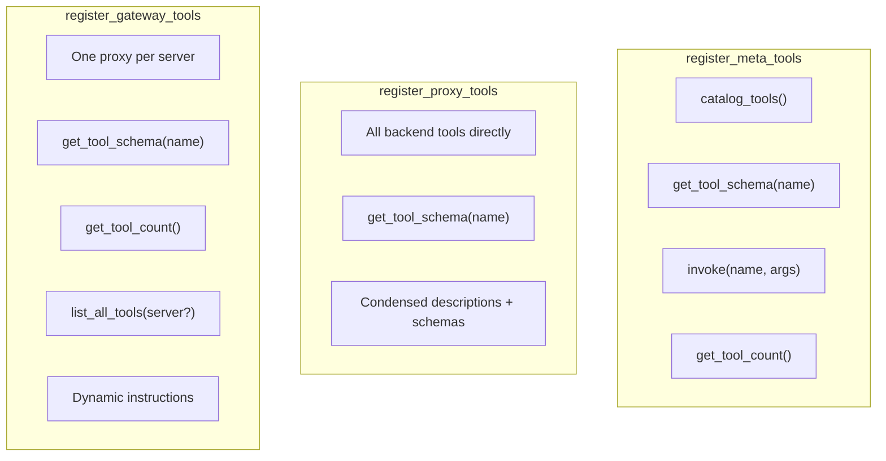
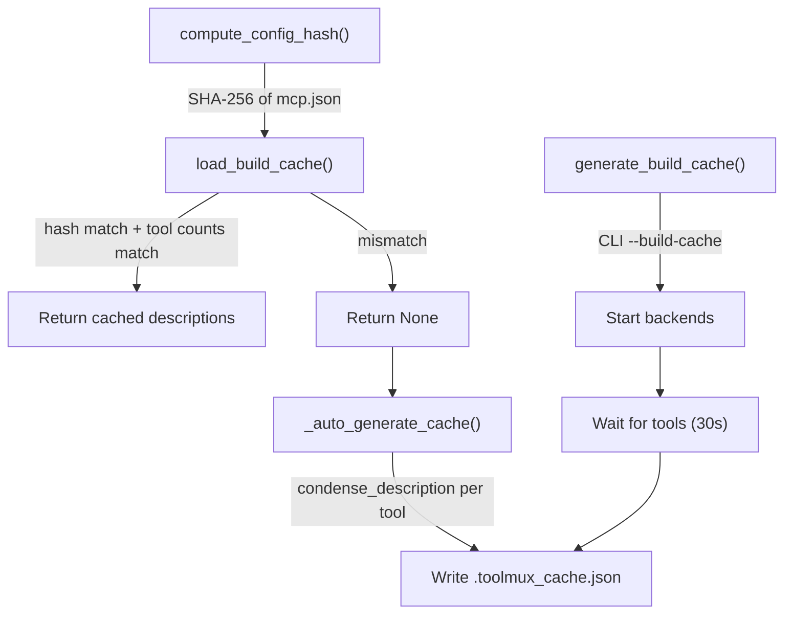
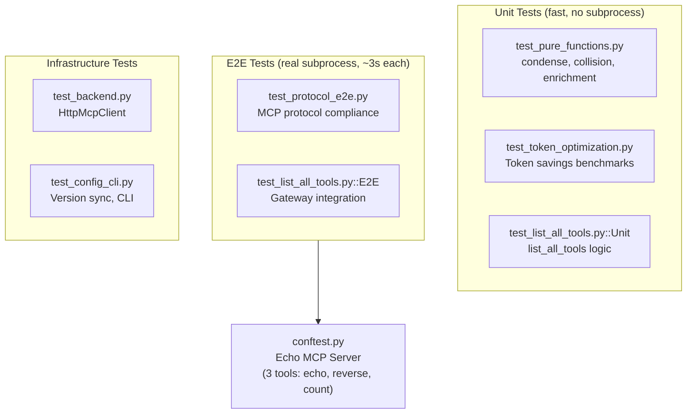
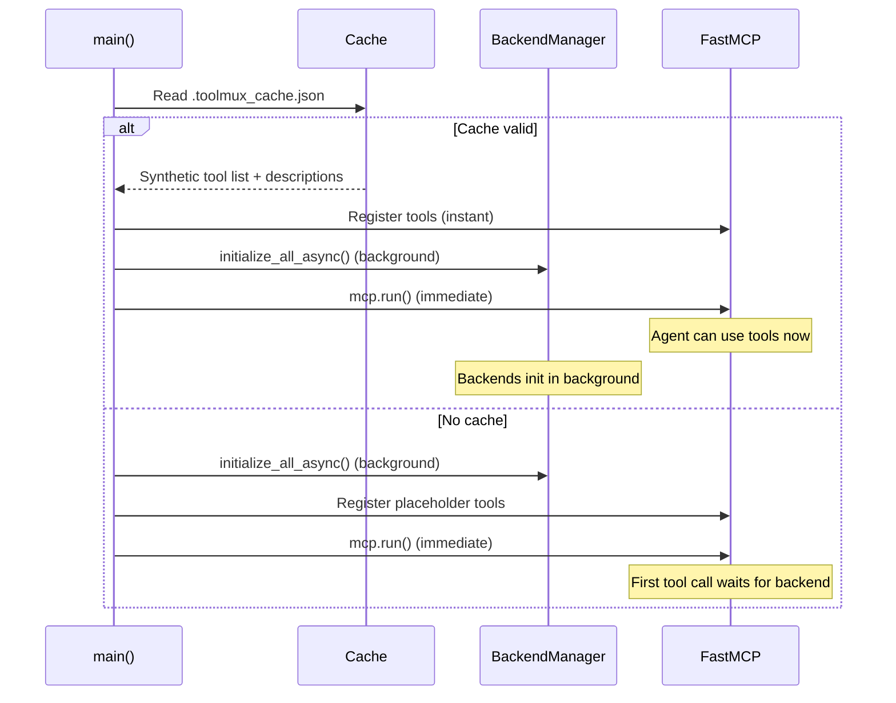

# ToolMux Developer Guide

## Codebase Overview

ToolMux is a single-file Python application (`toolmux/main.py`, ~1400 lines) built on FastMCP 3.x. It aggregates multiple MCP servers through one interface with token-optimized tool presentation.

### Repository Structure

```
ToolMux/
├── toolmux/
│   ├── __init__.py              # Package exports: main, BackendManager, HttpMcpClient
│   ├── __main__.py              # python -m toolmux entry point
│   ├── main.py                  # All core logic (1402 lines)
│   ├── Prompt/                  # Agent instruction templates
│   ├── examples/                # Example mcp.json configs
│   └── scripts/                 # Hook scripts
├── tests/
│   ├── conftest.py              # Echo MCP server fixture, test helpers
│   ├── test_pure_functions.py   # Unit tests for all pure functions
│   ├── test_token_optimization.py # Token savings benchmarks
│   ├── test_backend.py          # HttpMcpClient tests
│   ├── test_config_cli.py       # Version sync, CLI tests
│   ├── test_protocol_e2e.py     # Full MCP protocol E2E tests
│   └── test_list_all_tools.py   # list_all_tools unit + E2E tests
├── docs/
│   ├── ARCHITECTURE.md          # System design with mermaid diagrams
│   ├── USER_GUIDE.md            # End-user documentation
│   ├── DEVELOPER_GUIDE.md       # This file
│   ├── PUBLISHING.md            # Build and publish workflow
│   └── ...
├── scripts/
│   └── publish.sh               # Automated build→publish for alinux/osx
├── tool-metadata/               # Toolbox bundler metadata
├── toolmux.spec                 # PyInstaller spec file
├── pyproject.toml               # Package metadata + version
├── requirements.txt             # Dependencies
├── CHANGELOG.md                 # Version history
└── README.md                    # Project overview
```

### Why Single File?

All logic in `main.py` is intentional:
- PyInstaller bundles more reliably with fewer modules
- Easier to review and understand the full flow
- No circular import issues
- Grep-friendly for debugging

## Code Organization

`main.py` is organized into clear sections:



### Pure Functions (L92-273)

Stateless, testable functions with no side effects:

| Function | Purpose | Key Detail |
|---|---|---|
| `condense_description(desc, max_len=80)` | Shorten tool descriptions | Removes filler phrases, extracts first sentence, truncates at word boundary |
| `condense_schema(schema)` | Minimize JSON schemas | Keeps property names, types, required; strips descriptions, examples, defaults |
| `resolve_collisions(tools)` | Handle duplicate tool names | Prefixes with server name: `server-a__tool_name` |
| `enrich_result(name, result, described, cache)` | Progressive disclosure | Appends `[Tool:][Description:][Parameters:]` on first call only |
| `enrich_error_result(name, result, cache)` | Error enrichment | Always appends full schema on errors |
| `build_gateway_description(tools, cached)` | Server proxy description | Builds `"Tools: tool1 (desc), tool2 (desc)"` string |
| `build_gateway_instructions(servers, model)` | Dynamic instructions | Generates system prompt with server list and workflow |

### BackendManager (L363-522)

Manages all backend MCP server connections:



Key design decisions:
- **Parallel init**: `ThreadPoolExecutor(10 workers, 30s timeout)` — servers init concurrently
- **Background thread**: `initialize_all_async()` doesn't block — `mcp.run()` starts immediately
- **Lazy blocking**: `call_tool()` waits for `_init_complete` only if backends aren't ready yet
- **Silent errors**: All init errors suppressed (stderr goes to DEVNULL in stdio mode)
- **Thread safety**: `_lock` protects `tool_cache` mutations

### Mode Registration (L716-898)

Three functions register different tool sets with FastMCP:



### Build Cache (L903-1035)



Cache validation is strict:
1. `config_hash` must match SHA-256 of current `mcp.json`
2. Tool counts per server must match cached counts
3. Any mismatch → cache rejected, rebuilt from live backends

## Adding a New Native Tool

### Step 1: Choose the Registration Function

- All modes: Add to `register_manage_tool()` (L527)
- Gateway only: Add to `register_gateway_tools()` (L810)
- Meta only: Add to `register_meta_tools()` (L716)

### Step 2: Implement

```python
# In register_gateway_tools():
@mcp.tool()
def my_new_tool(param: str) -> str:
    """Short description for the LLM."""
    # Access backend via: backend.get_all_tools(), backend.call_tool()
    # Access cache via: cached_descriptions
    result = do_something(param)
    return json.dumps(result, indent=2)
```

### Step 3: Test

Create `tests/test_my_new_tool.py`:

```python
# Unit test (test logic directly)
def test_my_logic():
    result = my_logic_function(input)
    assert result == expected

# E2E test (real ToolMux subprocess)
class TestMyToolE2E:
    def test_works(self, test_config):
        proc = start_toolmux(mode="gateway", config_path=test_config(mode="gateway"))
        try:
            init_toolmux(proc)
            resp = send_jsonrpc(proc, "tools/call",
                {"name": "my_new_tool", "arguments": {"param": "value"}}, req_id=3)
            data = json.loads(resp["result"]["content"][0]["text"])
            assert data["expected_field"] == "expected_value"
        finally:
            proc.terminate(); proc.wait(timeout=5)
```

### Step 4: Version Bump

Update in TWO places:
1. `toolmux/main.py` L25: `VERSION = "X.Y.Z"`
2. `pyproject.toml`: `version = "X.Y.Z"`

## Testing

### Running Tests

```bash
# All tests
python3 -m pytest tests/ -v --tb=short

# Specific file
python3 -m pytest tests/test_pure_functions.py -v

# With output
python3 -m pytest tests/test_token_optimization.py -v -s
```

### Test Architecture



### Echo Server Fixture

`conftest.py` provides a minimal MCP server that:
- Responds to `initialize`, `tools/list`, `tools/call`
- Exposes 3 tools: `echo_tool`, `reverse_tool`, `count_tool`
- Used by all E2E tests

### Writing E2E Tests

```python
from tests.conftest import start_toolmux, init_toolmux, send_jsonrpc

def test_something(self, test_config):
    # Start ToolMux with echo server backend
    proc = start_toolmux(mode="gateway", config_path=test_config(mode="gateway"))
    try:
        init_toolmux(proc)  # MCP handshake

        # Call a tool
        resp = send_jsonrpc(proc, "tools/call",
            {"name": "echo", "arguments": {"tool": "echo_tool", "arguments": {"message": "hi"}}},
            req_id=3)

        # Parse result
        text = resp["result"]["content"][0]["text"]
        assert "hi" in text
    finally:
        proc.terminate()
        proc.wait(timeout=5)
```

## Publishing

### Quick Reference

```bash
# 1. Bump version in main.py + pyproject.toml
# 2. Commit and push
# 3. Publish to PyPI
cd /path/to/ToolMux
uv build
uv publish
```

## Key Design Patterns

### Cache-First Startup



### Progressive Disclosure

Instead of sending all tool schemas upfront (expensive), ToolMux:
1. Registers tools with condensed descriptions only
2. On first call to each tool, appends full description + schema to the response
3. Tracks which tools have been "disclosed" in `_described_tools` set
4. On errors, always includes schema (helps agent self-correct)

### Collision Resolution

When two servers expose a tool with the same name:
```
server-a: read_file, write_file
server-b: read_file, delete_file
→ After resolution:
   server-a_read_file, write_file, server-b_read_file, delete_file
```

## Common Development Tasks

### Adding a New Backend Transport

1. Create a client class similar to `HttpMcpClient` (L278)
2. Implement: `initialize()`, `get_tools()`, `call_tool()`
3. Add transport detection in `BackendManager.start_server()` (L436)
4. Add tests in `test_backend.py`

### Modifying Description Condensation

1. Edit `condense_description()` (L92) or `FILLER_PHRASES` (L39)
2. Run `python3 -m pytest tests/test_pure_functions.py -v` to verify
3. Run `python3 -m pytest tests/test_token_optimization.py -v -s` to check savings

### Changing Gateway Instructions

Edit `build_gateway_instructions()` (L243). The instructions are generated dynamically based on which servers are loaded and their tool counts.

## Infrastructure

| Resource | Value |
|---|---|
| Repository | `https://github.com/subnetangel/ToolMux` |
| PyPI | `https://pypi.org/project/toolmux/` |

## Dependencies

| Package | Version | Why |
|---|---|---|
| `fastmcp` | ≥3.0.0,<4 | MCP server framework (stdio transport, tool registration) |
| `mcp` | ≥1.20.0 | MCP protocol types (Tool class) |
| `click` | ≥8.0.0 | CLI framework (used by FastMCP internally) |
| `pydantic` | ≥2.6.0 | Data validation (used by FastMCP internally) |
| `httpx` | ≥0.24.0 | HTTP client for remote MCP servers |
| `python-dotenv` | ≥1.0.1 | Environment variable loading |
| `anyio` | — | Async I/O (FastMCP dependency, used for disconnect detection) |
