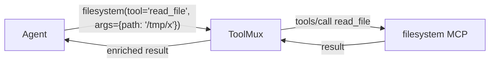

# ToolMux User Guide

## What is ToolMux?

ToolMux is an MCP (Model Context Protocol) server aggregator. It sits between an AI agent (like Kiro CLI) and multiple backend MCP servers, presenting them through a single optimized interface. Instead of the agent loading hundreds of tool schemas (consuming thousands of tokens), ToolMux condenses and routes them efficiently.

## Why Use ToolMux?

| Without ToolMux | With ToolMux |
|---|---|
| Agent loads all tool schemas from every MCP server | Agent sees condensed proxy tools |
| 258 tools = ~50,000 tokens of schema | 258 tools = ~2,500 tokens (95% savings) |
| Each server is a separate MCP connection | Single MCP connection |
| No description optimization | Smart condensation + caching |

## Installation

```bash
# Via PyPI
pip install toolmux

# Via uvx (recommended, no install needed)
uvx toolmux

# Verify
toolmux --version
```

## Quick Start

### Step 1: Create a Configuration

```bash
mkdir -p ~/shared/toolmux
cat > ~/shared/toolmux/mcp.json << 'EOF'
{
  "mode": "gateway",
  "servers": {
    "filesystem": {
      "command": "npx",
      "args": ["-y", "@modelcontextprotocol/server-filesystem", "/home/user"],
      "description": "Local filesystem access"
    }
  }
}
EOF
```

### Step 2: Run ToolMux

```bash
toolmux
```

ToolMux starts, connects to all configured backend servers, and presents them through a single MCP interface.

### Step 3: Connect Your Agent

In your `.kiro/mcp.json` or agent config:
```json
{
  "mcpServers": {
    "toolmux": {
      "command": "toolmux",
      "args": ["--mode", "gateway"]
    }
  }
}
```

## Operating Modes

### Gateway Mode (Default)

Best for most use cases. Creates one proxy tool per backend server.



The agent sees:
- One tool per server (e.g., `filesystem`, `git`, `slack`)
- Each tool's description lists its sub-tools
- Native helpers: `get_tool_count`, `get_tool_schema`, `list_all_tools`

**Calling pattern:**
```
filesystem(tool="read_file", arguments={"path": "/tmp/example.txt"})
```

**Token savings:** 60-95% depending on tool count.

### Meta Mode

Maximum savings. Four fixed tools regardless of backend count.

```
catalog_tools()                              → See all available tools
get_tool_schema(name="read_file")            → Get parameter details
invoke(name="read_file", args={path: "..."}) → Execute
get_tool_count()                             → Statistics
```

**Token savings:** 80-99%.

### Proxy Mode

All backend tools exposed directly with condensed descriptions. Most transparent — the agent doesn't know ToolMux exists.

**Token savings:** 40-60%.

## Configuration Reference

### Config File Locations (Discovery Order)

1. `--config /path/to/mcp.json` (CLI flag)
2. `./mcp.json` (current directory)
3. `~/shared/toolmux/mcp.json` (shared environments — persists across sessions)
4. `~/toolmux/mcp.json` (local installs)
5. First run auto-creates `~/shared/toolmux/mcp.json`

### Config Format

```json
{
  "mode": "gateway",
  "servers": {
    "my-server": {
      "command": "my-mcp-server",
      "args": ["--flag", "value"],
      "env": {"API_KEY": "secret"},
      "timeout": 120000,
      "description": "What this server does"
    },
    "remote-server": {
      "transport": "http",
      "base_url": "https://api.example.com/mcp",
      "headers": {"Authorization": "Bearer token"},
      "timeout": 30
    }
  }
}
```

| Field | Required | Default | Description |
|---|---|---|---|
| `mode` | No | `gateway` | Operating mode: gateway, meta, proxy |
| `servers` | Yes | — | Map of server name → config |
| `servers.*.command` | Yes (stdio) | — | Executable to run |
| `servers.*.args` | No | `[]` | Command arguments |
| `servers.*.env` | No | `{}` | Environment variables |
| `servers.*.timeout` | No | `120000` | Timeout in ms |
| `servers.*.description` | No | `""` | Human-readable description |
| `servers.*.transport` | No | `stdio` | `stdio` or `http` |
| `servers.*.base_url` | Yes (http) | — | HTTP server URL |
| `servers.*.headers` | No | `{}` | HTTP headers |

### Filtering Server Tools

Limit which tools a server exposes:
```json
{
  "command": "aws-sentral-mcp",
  "args": ["--include-tools", "search_accounts,get_account_details,search_pfrs"]
}
```

## CLI Reference

```bash
# Run in default gateway mode
toolmux

# Specify mode
toolmux --mode meta
toolmux --mode proxy
toolmux --mode gateway

# Custom config
toolmux --config /path/to/mcp.json

# List configured servers
toolmux --list-servers

# Generate description cache
toolmux --build-cache

# Server management
toolmux --manage list
toolmux --manage add --server-name my-mcp --server-command my-mcp-server
toolmux --manage remove --server-name my-mcp
toolmux --manage validate
toolmux --manage test
toolmux --manage test --server-name my-mcp

# Version
toolmux --version
```

## Native Tools (Available in All Modes)

### `manage_servers`

Manage backend MCP servers at runtime.

```
manage_servers(action="list")
manage_servers(action="add", name="my-mcp", command="my-mcp-server", description="My server")
manage_servers(action="remove", name="my-mcp")
manage_servers(action="validate")
manage_servers(action="test", name="my-mcp")
```

### `optimize_descriptions`

Improve tool descriptions using the LLM's intelligence.

```
optimize_descriptions(action="status")    → Check cache status
optimize_descriptions(action="generate")  → Get all tools for optimization
optimize_descriptions(action="save", server="my-server", descriptions={"tool": "desc"})
```

### `get_tool_schema` (Gateway + Meta)

Get full parameter schema for any backend tool.

```
get_tool_schema(name="read_file")
```

### `get_tool_count` (Gateway + Meta)

Get tool count statistics by server.

```
get_tool_count()
→ {"total_tools": 258, "by_server": {"builder-mcp": 46, "aws-sentral-mcp": 74, ...}}
```

### `list_all_tools` (Gateway only)

Enumerate all tool names and descriptions grouped by server.

```
list_all_tools()                    → All tools from all servers
list_all_tools(server="builder-mcp") → Only builder-mcp tools
```

## Description Cache

ToolMux caches condensed tool descriptions for instant startup.

### How It Works

1. First run: ToolMux waits for backends (~12s), auto-generates cache
2. Subsequent runs: Loads from cache (instant startup)
3. Cache invalidates when `mcp.json` changes (SHA-256 hash check)

### Cache File

Located at `~/shared/toolmux/.toolmux_cache.json` (next to your `mcp.json`).

### Manual Cache Generation

```bash
toolmux --build-cache
```

### LLM-Optimized Cache

Ask the agent to optimize descriptions:
```
"Optimize my ToolMux tool descriptions"
```

The agent calls `optimize_descriptions(action="generate")`, reviews all tools, writes concise descriptions, and saves them via `optimize_descriptions(action="save", ...)`.

## Progressive Disclosure

ToolMux doesn't front-load all tool schemas. Instead:

1. **First call** to any tool: Response includes full description + parameter schema
2. **Subsequent calls**: Raw result only (no extra tokens)
3. **Errors**: Always include full schema (helps the agent self-correct)

This teaches the agent tool interfaces on-demand rather than upfront.

## Troubleshooting

| Issue | Cause | Fix |
|---|---|---|
| `toolmux: command not found` | Not installed | `pip install toolmux` or `uvx toolmux` |
| Timeout on startup | Backends slow to init | Cache will be built; next run is instant |
| `Tool 'X' not found` | Backend not initialized yet | Wait a moment, retry |
| Stale descriptions | Config changed | Delete `.toolmux_cache.json`, restart |
| Server not connecting | Command not in PATH | `toolmux --manage validate` |
