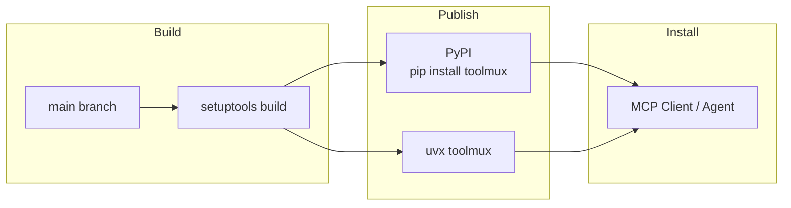

# ToolMux Internal-to-Public Sync Implementation Plan

> **For agentic workers:** REQUIRED SUB-SKILL: Use superpowers:subagent-driven-development (recommended) or superpowers:executing-plans to implement this plan task-by-task. Steps use checkbox (`- [ ]`) syntax for tracking.

**Goal:** Sync ToolMux from internal v2.2.1 to public GitHub, stripping all Amazon-specific content.

**Architecture:** Fresh overlay — rsync internal files into the GitHub clone (excluding .git), delete internal-only files, sanitize Amazon references in remaining files, run tests, push. No git merge needed.

**Tech Stack:** Python 3.10+, FastMCP 3.x, pytest, git, bash

---

## File Map

### Files to Delete (internal-only)
- `scripts/publish.sh`
- `docs/PUBLISHING.md`
- `tool-metadata/alinux.json`
- `tool-metadata/osx.json`
- `toolmux.spec`
- `.kiro/specs/toolmux-v2-fastmcp-rewrite/requirements.md`
- `.kiro/specs/toolmux-v2-fastmcp-rewrite/design.md`
- `.kiro/specs/toolmux-v2-fastmcp-rewrite/tasks.md`
- `toolmux/examples/example_mcp.json`
- `toolmux/examples/q-cli-toolmux-config.json`
- `Config`
- `ToolMux.code-workspace`
- `toolmux_entry.py`

### Files to Sanitize
- `pyproject.toml` — 3 URLs
- `toolmux/main.py` — 2 string literals
- `README.md` — installation, publishing, bundle resolution, config discovery sections
- `CHANGELOG.md` — internal server names, S3/registry/AIM details
- `CLAUDE.md` — outdated v1 structure, version reference
- `docs/ARCHITECTURE.md` — Mermaid diagram with S3/Builder Toolbox/AIM
- `docs/DEPLOYMENT_PLAN.md` — Amazon internal install options
- `docs/DEVELOPER_GUIDE.md` — infrastructure table
- `docs/USER_GUIDE.md` — Builder Toolbox/AIM install, troubleshooting
- `docs/PUBLICATION_REPORT.md` — code.amazon.com URL
- `.kiro/mcp.json` — description string

### Files Copied As-Is (no changes)
- All of `toolmux/main.py` logic (except 2 strings)
- All test files (`tests/`)
- All generic examples (`filesystem.json`, `brave-search.json`, etc.)
- `toolmux/__init__.py`, `toolmux/__main__.py`
- `toolmux/Prompt/TOOLMUX_AGENT_INSTRUCTIONS.md`
- `requirements.txt`, `Makefile`, `setup.sh`, `install.sh`, `LICENSE`

---

### Task 1: Copy Internal Files to GitHub Clone

**Files:**
- All files from `/tmp/toolmux-internal/` → `/tmp/toolmux-github/`

- [ ] **Step 1: Rsync internal repo into GitHub clone**

Run:
```bash
rsync -av --exclude='.git' /tmp/toolmux-internal/ /tmp/toolmux-github/
```

Expected: Files copied, preserving directory structure. The `.git` from the GitHub clone is preserved.

- [ ] **Step 2: Verify the overlay worked**

Run:
```bash
cd /tmp/toolmux-github && head -1 toolmux/main.py && grep 'version = ' pyproject.toml | head -1
```

Expected: Should show v2.2.1 content from the internal repo.

---

### Task 2: Delete Internal-Only Files

**Files:**
- Delete: `scripts/publish.sh`, `docs/PUBLISHING.md`, `tool-metadata/`, `toolmux.spec`, `.kiro/specs/toolmux-v2-fastmcp-rewrite/`, `toolmux/examples/example_mcp.json`, `toolmux/examples/q-cli-toolmux-config.json`, `Config`, `ToolMux.code-workspace`, `toolmux_entry.py`

- [ ] **Step 1: Delete all internal-only files**

Run:
```bash
cd /tmp/toolmux-github && rm -f \
  scripts/publish.sh \
  docs/PUBLISHING.md \
  toolmux.spec \
  toolmux/examples/example_mcp.json \
  toolmux/examples/q-cli-toolmux-config.json \
  Config \
  ToolMux.code-workspace \
  toolmux_entry.py

rm -rf tool-metadata/
rm -rf .kiro/specs/toolmux-v2-fastmcp-rewrite/
```

- [ ] **Step 2: Verify deletions**

Run:
```bash
cd /tmp/toolmux-github && ls scripts/publish.sh docs/PUBLISHING.md tool-metadata/ toolmux.spec 2>&1
```

Expected: All `No such file or directory` errors — files are gone.

- [ ] **Step 3: Commit deletions**

```bash
cd /tmp/toolmux-github && git add -A && git commit -m "chore: remove Amazon internal distribution files

Remove Builder Toolbox publish script, PUBLISHING.md, tool-metadata/,
PyInstaller spec, internal Kiro specs, and Amazon-specific example configs."
```

---

### Task 3: Sanitize pyproject.toml

**Files:**
- Modify: `pyproject.toml:50-53`

- [ ] **Step 1: Replace code.amazon.com URLs with GitHub URLs**

Edit `pyproject.toml`:

```
# old:
Homepage = "https://code.amazon.com/packages/ToolMux/trees/mainline"
Repository = "https://code.amazon.com/packages/ToolMux"
Issues = "https://code.amazon.com/packages/ToolMux/issues"

# new:
Homepage = "https://github.com/subnetangel/ToolMux"
Repository = "https://github.com/subnetangel/ToolMux"
Issues = "https://github.com/subnetangel/ToolMux/issues"
```

- [ ] **Step 2: Verify no Amazon references remain**

Run:
```bash
grep -i 'amazon\|code\.amazon\|aws-support' /tmp/toolmux-github/pyproject.toml
```

Expected: No output (no matches).

- [ ] **Step 3: Commit**

```bash
cd /tmp/toolmux-github && git add pyproject.toml && git commit -m "chore: update project URLs to GitHub"
```

---

### Task 4: Sanitize toolmux/main.py

**Files:**
- Modify: `toolmux/main.py:1667` (epilog URL)
- Modify: `toolmux/main.py:1427-1428` (docstring comment)

- [ ] **Step 1: Replace CLI epilog URL**

Edit `toolmux/main.py` line ~1667:

```python
# old:
        epilog="For more information, visit: https://code.amazon.com/packages/ToolMux/trees/mainline")

# new:
        epilog="For more information, visit: https://github.com/subnetangel/ToolMux")
```

- [ ] **Step 2: Replace docstring about Amazon internal**

Edit `toolmux/main.py` lines ~1427-1428:

```python
# old:
    config for a server. Supports both Amazon internal (mcp-registry/AIM)
    and open source (Claude Desktop, Cursor, mcp.json) config formats.

# new:
    config for a server. Supports mcp-registry bundles and standard
    MCP config files (Claude Desktop, Cursor, XDG mcp.json).
```

- [ ] **Step 3: Verify no Amazon references remain in main.py**

Run:
```bash
grep -in 'amazon\|code\.amazon\|aws-support\|isengard' /tmp/toolmux-github/toolmux/main.py
```

Expected: No output (no matches).

- [ ] **Step 4: Commit**

```bash
cd /tmp/toolmux-github && git add toolmux/main.py && git commit -m "chore: sanitize Amazon references in main.py"
```

---

### Task 5: Sanitize README.md

**Files:**
- Modify: `README.md` (installation, Kiro/AIM section, bundle resolution, publishing, config discovery)

- [ ] **Step 1: Replace installation section (lines ~22-33)**

Replace the entire installation block:

```markdown
## Installation

```bash
# Via PyPI
pip install toolmux

# Via uvx (recommended, no install needed)
uvx toolmux

# From source
git clone https://github.com/subnetangel/ToolMux.git
cd ToolMux
pip install -e .

# Verify
toolmux --version
```
```

- [ ] **Step 2: Replace "Use with Kiro CLI / AIM" section (lines ~71-83)**

Replace with:

```markdown
### 3. Use with any MCP client

Add to your MCP client configuration (e.g., Claude Desktop, Cursor, Kiro, VS Code):
```json
{
  "mcpServers": {
    "toolmux": {
      "command": "toolmux",
      "args": ["--mode", "gateway"]
    }
  }
}
```
```

- [ ] **Step 3: Sanitize Self-Healing Bundle Resolution section (lines ~251-259)**

Replace:
```markdown
1. **smithy-mcp bundles** (`~/.aim/bundles/`)
2. **AIM MCP bundles** (`~/.aim/bundles/`)
```

With:
```markdown
1. **mcp-registry bundles** (`~/.config/smithy-mcp/bundles/`)
2. **User bundles** (`~/.aim/bundles/`)
```

- [ ] **Step 4: Replace Config File Discovery path 3 (line ~283)**

Replace:
```
3. `~/shared/toolmux/mcp.json` (AgentSpaces — persists across sessions)
```
With:
```
3. `~/shared/toolmux/mcp.json` (shared environments — persists across sessions)
```

- [ ] **Step 5: Delete the entire Publishing section (lines ~370-388)**

Remove everything from `## Publishing` through the end of the `toolmux --version` verification code block. This includes:
- `ada credentials update` commands
- `./scripts/publish.sh` references
- `toolbox install toolmux --registry aws-support` verification

- [ ] **Step 6: Verify no Amazon references remain in README**

Run:
```bash
grep -in 'amazon\|code\.amazon\|aws-support\|isengard\|ada credentials\|toolbox install\|AIM mcp\|Builder Toolbox\|AgentSpaces' /tmp/toolmux-github/README.md
```

Expected: No output (no matches).

- [ ] **Step 7: Commit**

```bash
cd /tmp/toolmux-github && git add README.md && git commit -m "docs: sanitize README for public open-source release"
```

---

### Task 6: Sanitize CHANGELOG.md

**Files:**
- Modify: `CHANGELOG.md`

- [ ] **Step 1: Sanitize v2.2.0 entry (lines ~14-16)**

Replace:
```
- **Proxy mode: per-server error isolation** — Each backend is now mounted as an independent proxy. Previously, one crashing server (e.g., aws-support-troubleshooting-mcp's Redis `evalsha` error) would take down all servers in the composite. Now failures are isolated and logged; healthy servers continue serving.
```
With:
```
- **Proxy mode: per-server error isolation** — Each backend is now mounted as an independent proxy. Previously, one crashing server would take down all servers in the composite. Now failures are isolated and logged; healthy servers continue serving.
```

Replace:
```
- **Proxy mode: bundle resolution** — `_build_proxy_mcp_config()` now resolves AIM bundles and mcp-registry configs when a command isn't found on PATH. Fixes servers like `aws-knowledge-mcp-server-mcp` that only exist as bundles (resolved to `uvx fastmcp run <url>`).
```
With:
```
- **Proxy mode: bundle resolution** — `_build_proxy_mcp_config()` now resolves mcp-registry bundles when a command isn't found on PATH. Fixes servers that only exist as bundles (resolved to `uvx fastmcp run <url>`).
```

Replace:
```
- **Proxy mode: session persistence** — Bumped fastmcp minimum to 3.1.1 which fixes a bug where every tool call created a new backend connection instead of reusing sessions (fastmcp PR #3330). This was causing SAML-auth servers like `slack-mcp` to re-authenticate on every call.
```
With:
```
- **Proxy mode: session persistence** — Bumped fastmcp minimum to 3.1.1 which fixes a bug where every tool call created a new backend connection instead of reusing sessions. This was causing authenticated servers to re-authenticate on every call.
```

- [ ] **Step 2: Delete v2.1.0 Publishing subsection (lines ~27-28)**

Remove these lines entirely:
```
### Publishing
- Published v2.0.6 binary for alinux via Builder Toolbox
- macOS binary pending separate publish (`./scripts/publish.sh osx`)
```

- [ ] **Step 3: Sanitize v2.0.5 entry (lines ~41-48)**

Remove the `AIM MCP config` line from Changed section:
```
- AIM MCP config (`.kiro/mcp.json`) now uses `toolmux` (toolbox binary) instead of `python3 -m toolmux`
```

Delete the entire Publishing subsection:
```
### Publishing
- Published v2.0.5 binaries for both alinux and macOS via Builder Toolbox
- Added `scripts/publish.sh` for automated build→bundle→sign→publish flow
- S3 bucket: `s3://buildertoolbox-toolmux-us-west-2`
- Registry: `aws-support`
```

- [ ] **Step 4: Sanitize v1.1.3 entry (lines ~131-133)**

Replace:
```
- **Repository URLs**: Updated all repository references to point to Amazon internal repository: `https://code.amazon.com/packages/ToolMux`
- **Project URLs**: Updated PyPI project URLs to point to correct Amazon internal repository
- **Documentation**: Updated installation instructions and documentation links for internal development
```
With:
```
- **Repository URLs**: Updated all repository references
- **Project URLs**: Updated PyPI project URLs
- **Documentation**: Updated installation instructions and documentation links
```

- [ ] **Step 5: Verify no Amazon references remain**

Run:
```bash
grep -in 'amazon\|code\.amazon\|aws-support\|isengard\|s3://\|Builder Toolbox\|AIM \|ada credentials\|340458' /tmp/toolmux-github/CHANGELOG.md
```

Expected: No output.

- [ ] **Step 6: Commit**

```bash
cd /tmp/toolmux-github && git add CHANGELOG.md && git commit -m "docs: sanitize CHANGELOG for public release"
```

---

### Task 7: Sanitize docs/ARCHITECTURE.md

**Files:**
- Modify: `docs/ARCHITECTURE.md:305-330`

- [ ] **Step 1: Replace the Publishing & Distribution section**

Replace the entire section from `## Publishing & Distribution` through the S3 path table (lines ~305-330) with:

```markdown
## Distribution



| Method | Command |
|---|---|
| PyPI | `pip install toolmux` |
| uvx | `uvx toolmux` |
| Source | `git clone https://github.com/subnetangel/ToolMux && pip install -e .` |
```

- [ ] **Step 2: Verify**

Run:
```bash
grep -in 'amazon\|s3://\|toolbox\|aws-support\|AIM' /tmp/toolmux-github/docs/ARCHITECTURE.md
```

Expected: No output.

- [ ] **Step 3: Commit**

```bash
cd /tmp/toolmux-github && git add docs/ARCHITECTURE.md && git commit -m "docs: sanitize ARCHITECTURE.md for public release"
```

---

### Task 8: Sanitize docs/DEPLOYMENT_PLAN.md

**Files:**
- Modify: `docs/DEPLOYMENT_PLAN.md:50-117`

- [ ] **Step 1: Remove Amazon internal install sections**

Delete lines ~50-54 (the "For Amazon internal development" git clone block):
```
   # For Amazon internal development
   git clone https://code.amazon.com/packages/ToolMux
   cd ToolMux
   pip install -e .
```

Delete lines ~104-117 (Option 2 and Option 3 sections entirely):
```
#### Option 2: Amazon Internal Development Install
... through ...
#### Option 3: Amazon Internal Distribution
... through ...
- **Benefits**: Version control, internal security compliance
```

Delete lines ~252-253:
```
# Install from Amazon internal repository (development)
git clone https://code.amazon.com/packages/ToolMux
```

- [ ] **Step 2: Verify**

Run:
```bash
grep -in 'amazon\|code\.amazon\|internal' /tmp/toolmux-github/docs/DEPLOYMENT_PLAN.md
```

Expected: No matches (or only generic uses of "internal" not related to Amazon).

- [ ] **Step 3: Commit**

```bash
cd /tmp/toolmux-github && git add docs/DEPLOYMENT_PLAN.md && git commit -m "docs: sanitize DEPLOYMENT_PLAN.md for public release"
```

---

### Task 9: Sanitize docs/DEVELOPER_GUIDE.md

**Files:**
- Modify: `docs/DEVELOPER_GUIDE.md:373-385`

- [ ] **Step 1: Replace the Infrastructure table**

Replace lines ~373-385 (the entire Infrastructure section table):

```markdown
## Infrastructure

| Resource | Value |
|---|---|
| Repository | `https://github.com/subnetangel/ToolMux` |
| PyPI | `https://pypi.org/project/toolmux/` |
```

This removes: ssh://git.amazon.com, S3 bucket, AWS account, aws-support registry, AIM MCP ID, Bindle, CTI, Team.

- [ ] **Step 2: Verify**

Run:
```bash
grep -in 'amazon\|git\.amazon\|s3://\|aws-support\|isengard\|bindle\|340458' /tmp/toolmux-github/docs/DEVELOPER_GUIDE.md
```

Expected: No output.

- [ ] **Step 3: Commit**

```bash
cd /tmp/toolmux-github && git add docs/DEVELOPER_GUIDE.md && git commit -m "docs: sanitize DEVELOPER_GUIDE.md for public release"
```

---

### Task 10: Sanitize docs/USER_GUIDE.md

**Files:**
- Modify: `docs/USER_GUIDE.md:17-27` (installation)
- Modify: `docs/USER_GUIDE.md:297` (troubleshooting)

- [ ] **Step 1: Replace installation section**

Replace lines ~17-27:

```markdown
## Installation

```bash
# Via PyPI
pip install toolmux

# Via uvx (recommended, no install needed)
uvx toolmux

# Verify
toolmux --version
```
```

- [ ] **Step 2: Fix troubleshooting table entry**

Replace line ~297:
```
| `toolmux: command not found` | Not installed | `toolbox install toolmux --registry aws-support` |
```
With:
```
| `toolmux: command not found` | Not installed | `pip install toolmux` or `uvx toolmux` |
```

- [ ] **Step 3: Verify**

Run:
```bash
grep -in 'amazon\|toolbox install\|aws-support\|AIM\|Builder' /tmp/toolmux-github/docs/USER_GUIDE.md
```

Expected: No output.

- [ ] **Step 4: Commit**

```bash
cd /tmp/toolmux-github && git add docs/USER_GUIDE.md && git commit -m "docs: sanitize USER_GUIDE.md for public release"
```

---

### Task 11: Sanitize docs/PUBLICATION_REPORT.md and .kiro/mcp.json

**Files:**
- Modify: `docs/PUBLICATION_REPORT.md:163`
- Modify: `.kiro/mcp.json:7`

- [ ] **Step 1: Fix PUBLICATION_REPORT.md URL**

Replace line ~163:
```
- **Repository**: https://code.amazon.com/packages/ToolMux/trees/mainline
```
With:
```
- **Repository**: https://github.com/subnetangel/ToolMux
```

- [ ] **Step 2: Fix .kiro/mcp.json description**

Replace line ~7:
```json
      "description": "ToolMux - MCP server aggregation with gateway mode. Install via: toolbox install toolmux --registry aws-support"
```
With:
```json
      "description": "ToolMux - MCP server aggregation with gateway mode. Install via: pip install toolmux"
```

- [ ] **Step 3: Verify**

Run:
```bash
grep -rn 'code\.amazon\|toolbox install\|aws-support' /tmp/toolmux-github/.kiro/ /tmp/toolmux-github/docs/PUBLICATION_REPORT.md
```

Expected: No output.

- [ ] **Step 4: Commit**

```bash
cd /tmp/toolmux-github && git add docs/PUBLICATION_REPORT.md .kiro/mcp.json && git commit -m "docs: sanitize PUBLICATION_REPORT and Kiro config for public release"
```

---

### Task 12: Update CLAUDE.md

**Files:**
- Modify: `CLAUDE.md` (version, structure, architecture sections are outdated v1 content)

- [ ] **Step 1: Update version reference**

Replace line ~9:
```
- **Version**: 1.2.1
```
With:
```
- **Version**: 2.2.1
```

- [ ] **Step 2: Update dependency versions**

Replace line ~124:
```
- `fastmcp>=2.14.0,<3` - MCP server/client framework (proxy, mount, tool transforms, schema compression)
```
With:
```
- `fastmcp>=3.1.1,<4` - MCP server/client framework (proxy, mount, tool transforms, schema compression)
```

- [ ] **Step 3: Verify no Amazon references**

Run:
```bash
grep -in 'amazon\|code\.amazon\|aws-support' /tmp/toolmux-github/CLAUDE.md
```

Expected: No output (CLAUDE.md had no Amazon references, just outdated version info).

- [ ] **Step 4: Commit**

```bash
cd /tmp/toolmux-github && git add CLAUDE.md && git commit -m "docs: update CLAUDE.md version references for v2.2.1"
```

---

### Task 13: Final Verification Sweep

**Files:** All files in `/tmp/toolmux-github/`

- [ ] **Step 1: Grep for ALL Amazon-specific patterns across entire repo**

Run:
```bash
cd /tmp/toolmux-github && grep -rn --include='*.py' --include='*.md' --include='*.json' --include='*.toml' --include='*.sh' \
  -iE 'code\.amazon|git\.amazon|amazon\.com|aws-support|isengard|ada credentials|toolbox install|Builder Toolbox|AIM mcp|s3://buildertoolbox|340458|amzn-mcp|AgentSpaces' \
  --exclude-dir=.git .
```

Expected: **Zero matches.** If any remain, fix them before proceeding.

- [ ] **Step 2: Verify expected files are gone**

Run:
```bash
cd /tmp/toolmux-github && \
  test ! -f scripts/publish.sh && echo "OK: publish.sh gone" && \
  test ! -f docs/PUBLISHING.md && echo "OK: PUBLISHING.md gone" && \
  test ! -d tool-metadata && echo "OK: tool-metadata/ gone" && \
  test ! -f toolmux.spec && echo "OK: toolmux.spec gone" && \
  test ! -f toolmux_entry.py && echo "OK: toolmux_entry.py gone"
```

Expected: All "OK" lines.

---

### Task 14: Run Tests

**Files:** `tests/`

- [ ] **Step 1: Install dependencies**

Run:
```bash
cd /tmp/toolmux-github && pip install -e ".[dev]" 2>&1 | tail -5
```

Expected: Successfully installed toolmux and dev dependencies.

- [ ] **Step 2: Run full test suite**

Run:
```bash
cd /tmp/toolmux-github && python3 -m pytest tests/ -v --tb=short 2>&1
```

Expected: All 107 tests pass. No failures. (Sanitization only touched docs/URLs, not functional code.)

- [ ] **Step 3: If tests fail, diagnose and fix**

If any tests reference internal URLs or paths, fix them using the same sanitization patterns. Then re-run.

---

### Task 15: Push to GitHub

**Files:** Entire repo

- [ ] **Step 1: Check git status and log**

Run:
```bash
cd /tmp/toolmux-github && git status && git log --oneline -10
```

Expected: Clean working tree. Multiple sanitization commits visible.

- [ ] **Step 2: Push to origin**

Run:
```bash
cd /tmp/toolmux-github && git push origin main
```

Expected: Push succeeds to `github.com/subnetangel/ToolMux`.

- [ ] **Step 3: Verify on GitHub**

Run:
```bash
gh repo view subnetangel/ToolMux --json description,url
```

Expected: Repo accessible, latest commits visible.
